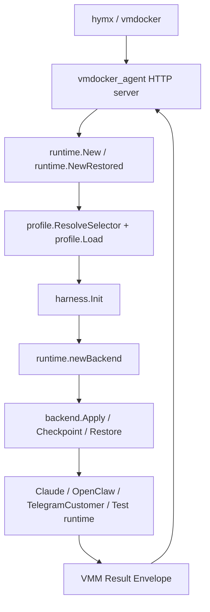
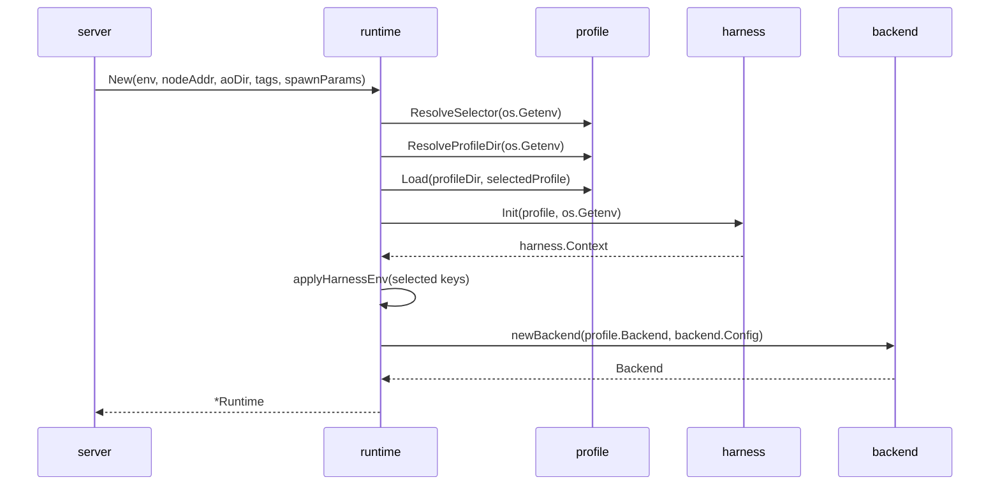
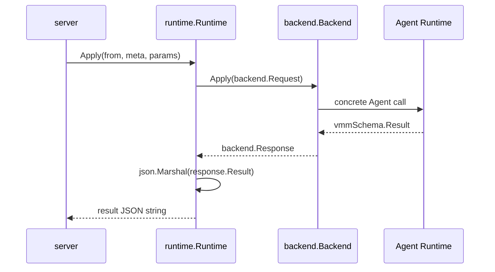
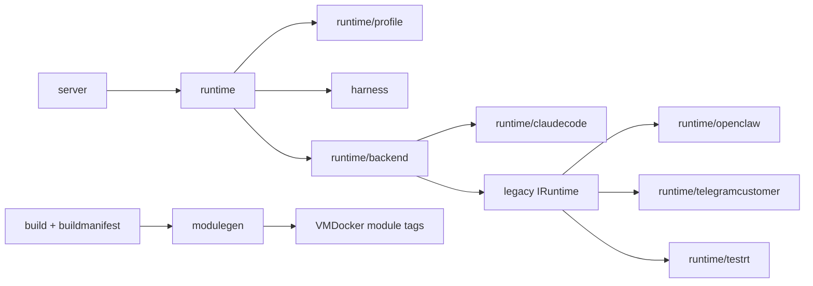
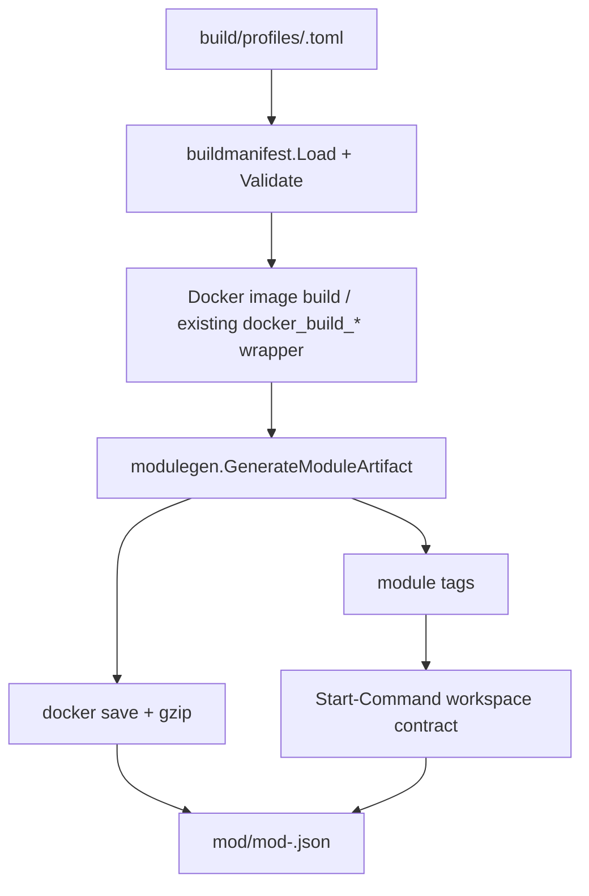
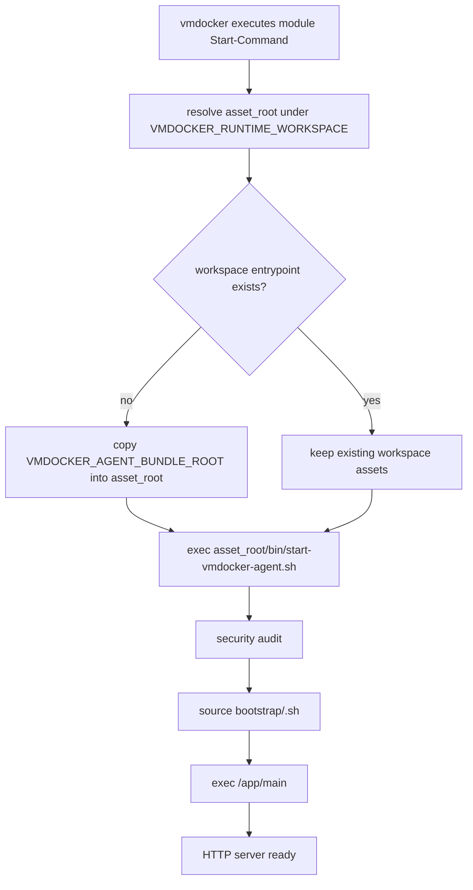
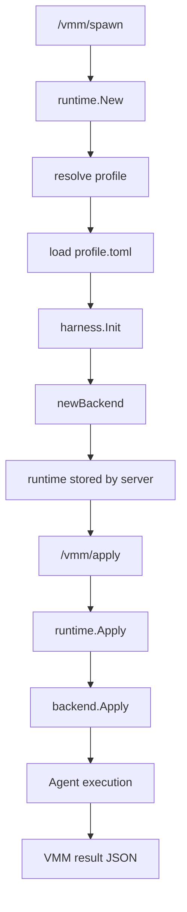
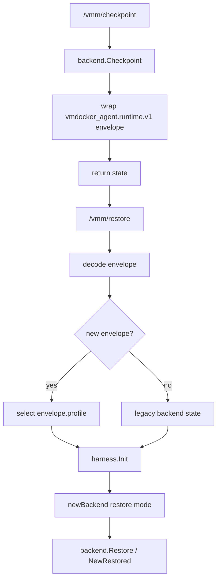

# vmdocker_agent 新架构说明

日期：2026-05-25

## 概要

`vmdocker_agent` 是 `hymx -> vmdocker -> vmdocker_agent(image)` 链路中的运行时容器工程。它对外承接 vmdocker 发来的 `/vmm/*` 请求，对内启动并约束具体 Agent，例如 Claude、OpenClaw、TelegramCustomer 或测试 runtime。

新架构把工程划分为三层核心职责：

1. `runtime`：负责 VMM 协议适配和 Agent 调用编排。它理解 `/vmm/spawn`、`/vmm/apply`、checkpoint、restore 等生命周期，并把这些请求转换成统一的 backend 调用。
2. `harness`：负责 Agent 的运行环境和约束。它不关心 `/vmm/*` 协议，只关心 workspace、home、role、skills、context、memory 等运行时资产如何在 vmdocker 提供的 workspace 下被初始化和校验。
3. `build`：负责镜像和 module 的声明式构建契约。它约束镜像启动命令、预置 profile/skill/role/bootstrap 资产，以及 module tag 如何描述 image runtime contract。

这三层之间的关键边界是：

- `runtime` 通过 profile 选择 backend，并调用 `harness.Init` 获取运行上下文。
- `harness` 只产出路径、环境变量和 skill/role 资源，不直接调用具体 Agent。
- `backend` 只负责具体 Agent 执行，不直接处理 VMM HTTP API，也不处理 module 打包。
- `build` 只描述和校验镜像/module 产物，不参与运行时请求处理。

整体调用顺序如下：



## 目录与模块总览

当前工程的主要目录按职责划分如下：

```text
vmdocker_agent/
├── runtime/                # VMM lifecycle orchestration and backend dispatch
│   ├── profile/            # Agent profile resolver and profile.toml parser
│   ├── backend/            # Backend interface plus concrete adapters
│   │   ├── claude/         # Claude backend adapter
│   │   └── legacy/         # Legacy IRuntime adapter
│   ├── claudecode/         # Existing Claude runtime implementation
│   ├── openclaw/           # Existing OpenClaw runtime implementation
│   ├── telegramcustomer/   # Existing TelegramCustomer runtime implementation
│   ├── testrt/             # In-memory test runtime
│   ├── runtime.go          # Runtime lifecycle entrypoint
│   └── checkpoint.go       # Unified checkpoint envelope
├── harness/                # Workspace-scoped Agent harness
│   ├── profiles/           # Runtime profile manifests
│   ├── roles/              # Role prompts
│   ├── skills/             # Prebuilt skill pool
│   └── harness.go          # Harness initializer and path validation
├── build/                  # Declarative build profiles
│   └── profiles/
├── buildmanifest/          # Build profile parser and validator
├── bootstrap/              # Runtime bootstrap hooks bundled into assets
├── modulegen/              # VMDocker module generation
├── server/                 # HTTP API server
└── start-vmdocker-agent.sh # Shared image/workspace entrypoint
```

## 核心设计：Profile + Backend

新架构使用 `profile + backend` 的两层模型来支持多 Agent。

### Profile

Profile 是运行时配置组合，描述“这次要启动什么 Agent，以及它需要什么 harness 资源”。它由 `harness/profiles/<name>/profile.toml` 定义。

典型 profile：

```toml
name = "claude"
backend = "claude"
asset_root = "${VMDOCKER_RUNTIME_WORKSPACE}/.vmdocker-agent"
role = "roles/claude.md"

[paths]
workspace = "${VMDOCKER_AGENT_WORKSPACE}"
home = "${VMDOCKER_RUNTIME_HOME}"
context = "${VMDOCKER_RUNTIME_WORKSPACE}/.vmdocker-agent/context"
memory = "${VMDOCKER_RUNTIME_WORKSPACE}/.vmdocker-agent/memory"
skills = "${VMDOCKER_RUNTIME_WORKSPACE}/.vmdocker-agent/skills"

[skills]
include = ["hymx-runtime"]

[env]
RUNTIME_TYPE = "claude"
```

Profile 主要承担这些职责：

- 选择 backend，例如 `claude`、`openclaw-legacy`、`telegramcustomer-legacy`、`test`。Hermes profile 复用 `telegramcustomer-legacy` backend。
- 声明 workspace、home、context、memory、skills 等路径模板。
- 声明 role 文件。
- 声明启用哪些 skills。
- 声明 profile 需要的默认 env。

Profile 的选择规则集中在 `runtime/profile`：

1. 优先读取 `VMDOCKER_AGENT_PROFILE`。
2. 如果未设置，则用 `RUNTIME_TYPE` 做兼容映射：
   - `claude -> claude`
   - `openclaw` 或空值 `-> openclaw-legacy`
   - `telegramcustomer -> telegramcustomer-legacy`
   - `test -> test`
3. 未知值会按 profile 名称尝试加载；如果是旧 `RUNTIME_TYPE` 路径触发的未知值，则返回兼容错误：`runtime type not supported: <value>`。

### Backend

Backend 是具体 Agent 的执行适配层，统一接口定义在 `runtime/backend/backend.go`：

```go
type Backend interface {
    Apply(Request) (Response, error)
    Checkpoint() (string, error)
    Restore(string) error
}
```

Backend 的职责是：

- 把统一的 `backend.Request` 转成具体 Agent 调用。
- 返回统一的 `backend.Response`，其中包含 VMM result。
- 保存和恢复 Agent 自己的状态。

当前 backend 类型：

- `runtime/backend/claude`：包装现有 `runtime/claudecode`，作为新架构参考实现。
- `runtime/backend/legacy`：包装旧的 `runtime/schema.IRuntime`，用于兼容 OpenClaw、TelegramCustomer 和 test runtime。

这种设计让新增 Agent 时不需要改 server API，也不需要把 harness 逻辑复制到每个 runtime 中。新增 Agent 的主要工作是新增 profile、role/skill/bootstrap 资产，以及一个 backend adapter。

## runtime 模块

`runtime` 是 vmdocker_agent 的核心编排层。它位于 HTTP server 和具体 Agent backend 之间。

### 职责

`runtime` 负责：

- 接收 server 传入的 VMM env、node address、tags、spawn params。
- 根据环境变量解析 profile。
- 加载 profile manifest。
- 初始化 harness。
- 根据 profile 的 `backend` 创建 backend。
- 将 `/vmm/apply` 转换成 `backend.Apply`。
- 将 backend 返回结果序列化成 VMM result JSON。
- 统一封装 checkpoint。
- restore 时识别新旧 checkpoint 格式。

`runtime` 不负责：

- 不创建 HTTP route。
- 不直接管理 skill 文件复制。
- 不定义 Docker image 构建流程。
- 不直接写死每个 Agent 的 role/context/memory 目录。

### Spawn 调用顺序

`/vmm/spawn` 最终会调用 `runtime.New`。

顺序如下：



`applyHarnessEnv` 只把 backend 必须消费的 harness env 写入进程环境：

- `VMDOCKER_AGENT_ASSET_ROOT`
- `VMDOCKER_AGENT_SKILLS_DIR`
- `VMDOCKER_AGENT_ROLE_PATH`
- `VMDOCKER_AGENT_CONTEXT_DIR`
- `VMDOCKER_AGENT_MEMORY_DIR`

它不会写回 selector env，例如 `VMDOCKER_AGENT_PROFILE`、`VMDOCKER_AGENT_PROFILE_DIR`、`RUNTIME_TYPE`。这样可以减少不同 spawn 之间的环境污染。

### Apply 调用顺序

`/vmm/apply` 最终会调用 `Runtime.Apply`。



`runtime` 不解释具体 action 的业务语义。Claude、OpenClaw 或 TelegramCustomer 如何处理 `Chat`、`Query`、`Execute` 等 action，由各自 backend/runtime 负责。

### Checkpoint 调用顺序

`Runtime.Checkpoint` 会先让 backend 产出 backend state，然后包一层统一 envelope：

```json
{
  "format": "vmdocker_agent.runtime.v1",
  "profile": "claude",
  "backend": "claude",
  "harness": {
    "workspace": "...",
    "home": "...",
    "context": "...",
    "memory": "..."
  },
  "backendState": "{...}"
}
```

这个 envelope 的作用是把“平台层状态”和“具体 Agent 状态”拆开：

- `profile` 和 `backend` 说明 restore 时应该恢复哪条 runtime 路径。
- `harness` 记录当时的关键目录，便于诊断和兼容。
- `backendState` 完全交给 backend 自己解释。

### Restore 调用顺序

`runtime.NewRestored` 会调用同一个 `newRuntime`，但额外传入 checkpoint state。

顺序如下：

1. 尝试解析 checkpoint envelope。
2. 如果是 `vmdocker_agent.runtime.v1`：
   - 用 envelope 中的 `profile` 覆盖当前环境选择。
   - 把 `backendState` 传给 backend。
3. 如果不是 vmdocker_agent envelope：
   - 视为旧格式 state。
   - 直接交给对应 backend 或 legacy runtime 兼容处理。
4. 重新加载当前镜像/asset 中的 profile。
5. 重新初始化 harness。
6. 创建 backend，并按 restore 模式恢复 backend state。

`decodeCheckpointEnvelope` 对未来格式做了保护：如果 `format` 以 `vmdocker_agent.` 开头但不是当前支持版本，会返回明确错误，避免误把新格式当旧格式吞掉。

## harness 模块

`harness` 是 Agent 运行环境层。它的核心文件是 `harness/harness.go`。

### 职责

`harness` 负责：

- 从 profile 中解析路径模板。
- 从 vmdocker 注入 env 中确定 runtime workspace。
- 创建 asset root、workspace、home、context、memory、skills 目录。
- 校验所有 Agent 可见路径都在 runtime workspace 下。
- 校验 role path 不允许绝对路径或 `..` traversal。
- 校验 skill name 不允许路径分隔符或 traversal。
- 检查 profile 声明的每个 skill 是否存在 `SKILL.md`。
- 生成 `harness.Context`，供 runtime/backend 使用。

`harness` 不负责：

- 不处理 `/vmm/*` API。
- 不调用 Claude/OpenClaw。
- 不构建镜像。
- 不决定哪个 profile 被选中。

### Workspace 契约

`harness` 以 vmdocker 注入的 workspace env 为唯一可信根目录。优先使用：

```text
VMDOCKER_RUNTIME_WORKSPACE
```

如果它不存在，则尝试从：

```text
VMDOCKER_AGENT_WORKSPACE
```

取 parent 作为 runtime workspace。

runtime workspace 必须满足：

- 非空。
- 绝对路径。
- 不能是 `/`。

Agent 可见目录必须全部位于 runtime workspace 内：

```text
${VMDOCKER_RUNTIME_WORKSPACE}/
├── workspace/              # VMDOCKER_AGENT_WORKSPACE
├── .home/                  # VMDOCKER_RUNTIME_HOME / HOME
├── .tmp/                   # TMPDIR
├── .xdg/
└── .vmdocker-agent/
    ├── bin/
    ├── bootstrap/
    ├── profiles/
    ├── roles/
    ├── skills/
    ├── context/
    └── memory/
```

其中 `.vmdocker-agent` 不是“额外挂载层”，而是 workspace 内的 harness asset root。它用于把 Agent 自身资产和用户工作目录隔离开：

- `workspace/`：Agent 处理用户任务的工作目录。
- `.home/`：Agent 进程 HOME。
- `.vmdocker-agent/`：profile、role、skills、context、memory、bootstrap、entrypoint 等 Agent 运行资产。

这个目录必须在 `VMDOCKER_RUNTIME_WORKSPACE` 下，不能依赖 `/usr/local` 作为外部契约。

### harness.Context

`harness.Init` 输出：

```go
type Context struct {
    ProfileName string
    Backend     string
    AssetRoot   string
    Workspace   string
    Home        string
    ContextDir  string
    MemoryDir   string
    SkillsDir   string
    RolePath    string
    SkillPaths  []string
    Env         map[string]string
}
```

这个对象是 runtime 和 backend 之间的环境边界：

- runtime 用它写入必要 env。
- backend 可以用它定位 role、skills、context、memory。
- checkpoint envelope 用它记录关键 harness 路径。

## build 模块

`build` 层负责让 image 和 module 的产物契约标准化。

### Build Profile

构建 profile 位于：

```text
build/profiles/<name>.toml
```

当前 Claude profile 示例：

```toml
name = "claude"
runtime_profile = "claude"
dockerfile = "Dockerfile.claude"
image_name = "chriswebber/docker-claude"
start_command = "sh -lc 'asset_root=\"${VMDOCKER_AGENT_ASSET_ROOT:-$VMDOCKER_RUNTIME_WORKSPACE/.vmdocker-agent}\"; bundle_root=\"${VMDOCKER_AGENT_BUNDLE_ROOT:-/opt/vmdocker-agent-bundle}\"; if [ ! -x \"$asset_root/bin/start-vmdocker-agent.sh\" ] && [ -d \"$bundle_root\" ]; then mkdir -p \"$asset_root\"; cp -R \"$bundle_root/.\" \"$asset_root/\"; chmod +x \"$asset_root/bin/start-vmdocker-agent.sh\"; fi; exec \"$asset_root/bin/start-vmdocker-agent.sh\"'"

[assets]
profiles = ["claude"]
skills = ["hymx-runtime"]
roles = ["claude"]
bootstrap = ["claude.sh"]

[env]
VMDOCKER_AGENT_PROFILE = "claude"
RUNTIME_TYPE = "claude"

[module_tags]
Sandbox-Agent = "shell"
Start-Command = "sh -lc 'asset_root=\"${VMDOCKER_AGENT_ASSET_ROOT:-$VMDOCKER_RUNTIME_WORKSPACE/.vmdocker-agent}\"; bundle_root=\"${VMDOCKER_AGENT_BUNDLE_ROOT:-/opt/vmdocker-agent-bundle}\"; if [ ! -x \"$asset_root/bin/start-vmdocker-agent.sh\" ] && [ -d \"$bundle_root\" ]; then mkdir -p \"$asset_root\"; cp -R \"$bundle_root/.\" \"$asset_root/\"; chmod +x \"$asset_root/bin/start-vmdocker-agent.sh\"; fi; exec \"$asset_root/bin/start-vmdocker-agent.sh\"'"
```

`buildmanifest` 当前负责解析和校验 build profile，至少保证：

- `name` 必填。
- `runtime_profile` 必填。
- `dockerfile` 必填。
- `image_name` 必填。
- `start_command` 必须通过 `VMDOCKER_RUNTIME_WORKSPACE` 解析。
- module tag 中的 `Start-Command` 如果存在，也必须通过 `VMDOCKER_RUNTIME_WORKSPACE` 解析。

### Module Start-Command 契约

旧契约使用：

```text
/usr/local/bin/start-vmdocker-agent.sh
```

新契约改为 workspace-scoped：

```text
sh -lc 'asset_root="${VMDOCKER_AGENT_ASSET_ROOT:-$VMDOCKER_RUNTIME_WORKSPACE/.vmdocker-agent}"; bundle_root="${VMDOCKER_AGENT_BUNDLE_ROOT:-/opt/vmdocker-agent-bundle}"; if [ ! -x "$asset_root/bin/start-vmdocker-agent.sh" ] && [ -d "$bundle_root" ]; then mkdir -p "$asset_root"; cp -R "$bundle_root/." "$asset_root/"; chmod +x "$asset_root/bin/start-vmdocker-agent.sh"; fi; exec "$asset_root/bin/start-vmdocker-agent.sh"'
```

它的执行逻辑是：

1. 计算 `asset_root`：
   - 优先 `VMDOCKER_AGENT_ASSET_ROOT`
   - 默认 `$VMDOCKER_RUNTIME_WORKSPACE/.vmdocker-agent`
2. 计算 `bundle_root`：
   - 优先 `VMDOCKER_AGENT_BUNDLE_ROOT`
   - 默认 `/opt/vmdocker-agent-bundle`
3. 如果 workspace 中还没有可执行的 `bin/start-vmdocker-agent.sh`，且 image bundle 存在：
   - 创建 asset root。
   - 把 bundle 内容复制到 asset root。
   - 给 workspace entrypoint 加执行权限。
4. `exec "$asset_root/bin/start-vmdocker-agent.sh"`。

这保证 module 对 vmdocker 暴露的标准启动点位于 workspace 内，而不是镜像内 `/usr/local`。

### start-vmdocker-agent.sh

`start-vmdocker-agent.sh` 是共享 entrypoint。它支持两种 bootstrap 来源：

1. 显式 `VMDOCKER_AGENT_BOOTSTRAP_DIR`。
2. `${VMDOCKER_AGENT_ASSET_ROOT}/bootstrap`。
3. 兼容 fallback：`/usr/local/lib/vmdocker-agent/bootstrap`。

启动流程：

1. 计算 `APP_ROOT`，默认 `/app`。
2. 计算并必要时物化 `ASSET_ROOT`。
3. 选择 `BOOTSTRAP_DIR`。
4. 校验 `${APP_ROOT}/main` 可执行。
5. 读取 `RUNTIME_TYPE`，默认 `openclaw`。
6. 校验 runtime type 是否在允许列表中。
7. 执行安全审计。
8. source 对应 runtime bootstrap hook。
9. `exec "${APP_ROOT}/main"`。

## server 模块

`server` 是 HTTP API 层，负责暴露 VMM 接口。它不应该理解具体 Agent，也不应该直接管理 skill/harness 文件。

典型职责：

- 接收 `/vmm/health`。
- 接收 `/vmm/spawn` 并创建 `runtime.Runtime`。
- 接收 `/vmm/apply` 并转发到 runtime。
- 接收 checkpoint/restore 请求并转发 runtime。
- 保持对 hymx/vmdocker 的协议兼容。

server 与 runtime 的关系应该保持单向：

```text
server -> runtime -> profile/harness/backend -> concrete agent
```

不要让 backend 反向依赖 server，也不要让 server 根据 `RUNTIME_TYPE` 分支到具体 Agent。

## 模块间关系

整体依赖方向应保持如下：



依赖原则：

- `server` 可以依赖 `runtime`，但不依赖具体 Agent runtime。
- `runtime` 可以依赖 `profile`、`harness`、`backend`。
- `harness` 可以依赖 `runtime/profile` 的 profile struct，但不依赖 backend。
- `backend` 可以依赖具体 Agent 实现。
- 具体 Agent 实现不应该依赖 `server`。
- `buildmanifest` 和 `modulegen` 不应该参与运行时请求处理。

## 关键生命周期

### 镜像构建到 module 打包



### 容器启动



### Spawn + Apply



### Checkpoint + Restore



## 如何添加新的 Agent

推荐按以下顺序添加新 Agent。

### 1. 添加 backend adapter

在 `runtime/backend/<agent>/` 下实现：

```go
type Backend struct {
    // concrete runtime/client/session
}

func New(cfg backend.Config) (*Backend, error) {
    // initialize concrete Agent
}

func (b *Backend) Apply(req backend.Request) (backend.Response, error) {
    // translate VMM action to Agent call
}

func (b *Backend) Checkpoint() (string, error) {
    // return Agent-owned state
}

func (b *Backend) Restore(data string) error {
    // restore Agent-owned state
}
```

然后在 `runtime.newBackend` 增加一个 backend name 分支。

### 2. 添加 runtime profile

新增：

```text
harness/profiles/<agent>/profile.toml
```

至少包含：

- `name`
- `backend`
- `asset_root`
- `role`
- `[paths]`
- `[skills]`
- `[env]`

Profile 中的路径必须解析到 `VMDOCKER_RUNTIME_WORKSPACE` 下。

### 3. 添加 role

新增：

```text
harness/roles/<agent>.md
```

Profile 用相对路径引用：

```toml
role = "roles/<agent>.md"
```

不要在 profile 中写绝对 role 路径。

### 4. 添加 skills

把可复用 skill 放入：

```text
harness/skills/<skill-name>/SKILL.md
```

然后在 profile 中声明：

```toml
[skills]
include = ["<skill-name>"]
```

新增 skill 不需要改 runtime 代码。runtime 只会根据 profile 声明检查 skill 是否存在。

### 5. 添加 bootstrap hook

如果新 Agent 需要启动前初始化依赖或配置，新增：

```text
bootstrap/<runtime-type>.sh
```

entrypoint 会根据 `RUNTIME_TYPE` source 对应 hook。

### 6. 添加 build profile

新增：

```text
build/profiles/<agent>.toml
```

声明：

- runtime profile。
- Dockerfile。
- image name。
- start command。
- assets。
- env。
- module tags。

### 7. 添加测试

至少补这些测试：

- `runtime/profile`：selector 和 profile 加载。
- `harness`：路径、role、skill 校验。
- `runtime/backend/<agent>`：Apply、Checkpoint、Restore。
- `server`：spawn/apply 兼容。
- `buildmanifest`：build profile 校验。
- `scripts/test_start_vmdocker_agent.sh`：bootstrap 或 workspace asset 行为。

## 错误边界

推荐错误归属如下：

- profile 名称不合法：`runtime/profile` 返回错误。
- profile 文件不存在或 TOML 无效：`runtime/profile.Load` 返回错误。
- runtime workspace 缺失或不是绝对路径：`harness.Init` 返回错误。
- harness 路径逃逸 workspace：`harness.Init` 返回错误。
- role path 使用绝对路径或 traversal：`harness.Init` 返回错误。
- skill 缺失：`harness.Init` 返回错误。
- backend 名称不支持：`runtime.newBackend` 返回错误。
- Agent 执行失败：backend 返回错误，runtime 包装为 `runtime apply failed`。
- checkpoint future format 不支持：`decodeCheckpointEnvelope` 返回错误。

这个边界可以让错误在最接近源头的位置暴露，同时避免 server 层出现大量 Agent-specific 分支。

## 当前兼容状态

当前架构是渐进式迁移状态：

- Claude 已经通过 `runtime/backend/claude` 接入新 backend 接口。
- OpenClaw 仍使用 legacy runtime，通过 `runtime/backend/legacy` 接入。
- TelegramCustomer 仍使用 legacy runtime，通过 `runtime/backend/legacy` 接入。
- Hermes 是新流程入口 profile，内部复用 TelegramCustomer/Hermes runtime package 和 `telegramcustomer-legacy` backend。
- test runtime 也通过 legacy wrapper 接入。
- `/vmm/*` 外部 API 语义保持兼容。
- `RUNTIME_TYPE` 兼容路径仍保留，但新路径推荐使用 `VMDOCKER_AGENT_PROFILE`。

## 测试方法

不依赖外部 `claude-gw` 解析的核心测试：

```bash
go test ./runtime/profile ./harness ./runtime/backend/... ./buildmanifest ./modulegen
```

entrypoint、workspace asset 和 bundle 物化测试：

```bash
./scripts/test_start_vmdocker_agent.sh
```

modulegen 测试：

```bash
go test ./modulegen
```

build profile 校验：

```bash
go run ./cmd/build -profile build/profiles/claude.toml
```

全量测试：

```bash
go test ./...
```

如果全量测试遇到：

```text
github.com/xingj404-lab/claude-gw@v0.0.1: invalid version: unknown revision v0.0.1
```

需要先修正 `go.mod` 中 `github.com/xingj404-lab/claude-gw` 的可访问版本，或恢复一个有效的本地 `replace`，再运行全量测试。

## 设计约束

后续改动应保持以下约束：

1. Agent 可见路径必须统一落在 `VMDOCKER_RUNTIME_WORKSPACE` 下。
2. `/usr/local` 可以作为镜像内部实现路径，但不能作为 vmdocker/module 对外启动契约。
3. `server` 不应该直接分发到具体 Agent。
4. 新 Agent 应通过 `profile + backend` 接入。
5. 新 skill 应通过 `harness/skills` 和 profile manifest 启用，不应修改 runtime 分支逻辑。
6. checkpoint envelope 只保存平台层必要信息，backend 私有状态放在 `backendState`。
7. build profile 和 module tag 必须明确表达 workspace-scoped `Start-Command`。
