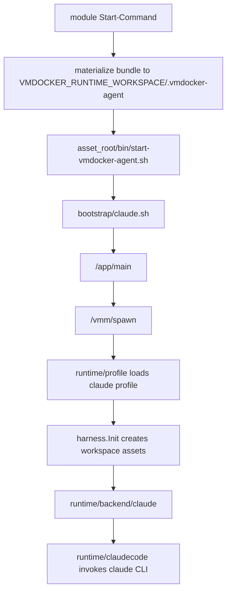

# 从零配置 Claude Agent 教程

日期：2026-05-25

本文说明如何基于 `vmdocker_agent` 新架构配置一个 Claude Agent，覆盖：

1. 配置 build 相关文件。
2. 生成 VMDocker module。
3. 配置 runtime profile。
4. 启动并测试 `/vmm/spawn`、`/vmm/apply`、`/vmm/checkpoint`、`/vmm/restore`。

教程默认在仓库根目录执行：

```bash
cd /Users/webbergao/work/src/HymxWorkspace/vmdocker_agent
```

## 0. 新架构中的 Claude Agent 组成

Claude Agent 由三类配置共同组成：

```text
build/profiles/claude.toml          # build/module 产物契约
Dockerfile.claude                   # Claude image 构建定义
harness/profiles/claude/profile.toml # runtime profile
harness/roles/claude.md             # Claude role
harness/skills/hymx-runtime/SKILL.md # profile 启用的 skill
bootstrap/claude.sh                 # 容器启动前 bootstrap hook
```

运行时调用链：



## 1. 配置 Build 相关文件

### 1.1 配置 `build/profiles/claude.toml`

`build/profiles/claude.toml` 是 Claude image 和 module tag 的声明式入口。至少需要包含：

```toml
name = "claude"
runtime_profile = "claude"
dockerfile = "Dockerfile.claude"
context = "."
image_name = "chriswebber/docker-claude"
start_command = "sh -lc 'asset_root=\"${VMDOCKER_AGENT_ASSET_ROOT:-$VMDOCKER_RUNTIME_WORKSPACE/.vmdocker-agent}\"; bundle_root=\"${VMDOCKER_AGENT_BUNDLE_ROOT:-/opt/vmdocker-agent-bundle}\"; if [ ! -x \"$asset_root/bin/start-vmdocker-agent.sh\" ] && [ -d \"$bundle_root\" ]; then mkdir -p \"$asset_root\"; cp -R \"$bundle_root/.\" \"$asset_root/\"; chmod +x \"$asset_root/bin/start-vmdocker-agent.sh\"; fi; exec \"$asset_root/bin/start-vmdocker-agent.sh\"'"

[assets]
profiles = ["claude"]
skills = ["hymx-runtime"]
roles = ["claude"]
bootstrap = ["claude.sh"]

[env]
VMDOCKER_AGENT_PROFILE = "claude"
RUNTIME_TYPE = "claude"

[module_tags]
Sandbox-Agent = "shell"
Start-Command = "sh -lc 'asset_root=\"${VMDOCKER_AGENT_ASSET_ROOT:-$VMDOCKER_RUNTIME_WORKSPACE/.vmdocker-agent}\"; bundle_root=\"${VMDOCKER_AGENT_BUNDLE_ROOT:-/opt/vmdocker-agent-bundle}\"; if [ ! -x \"$asset_root/bin/start-vmdocker-agent.sh\" ] && [ -d \"$bundle_root\" ]; then mkdir -p \"$asset_root\"; cp -R \"$bundle_root/.\" \"$asset_root/\"; chmod +x \"$asset_root/bin/start-vmdocker-agent.sh\"; fi; exec \"$asset_root/bin/start-vmdocker-agent.sh\"'"
```

关键点：

- `runtime_profile = "claude"` 对应 `harness/profiles/claude/profile.toml`。
- `Start-Command` 必须通过 `VMDOCKER_RUNTIME_WORKSPACE` 解析到 workspace。
- 不要把 module 的标准启动契约写成 `/usr/local/bin/start-vmdocker-agent.sh`。

校验 build profile：

```bash
go run ./cmd/build -profile build/profiles/claude.toml
```

期望输出包含：

```text
build profile: claude
runtime profile: claude
image: chriswebber/docker-claude
start command: sh -lc ...
```

### 1.2 配置 Dockerfile 的 workspace asset bundle

module `Start-Command` 会从只读 image bundle 物化到：

```text
${VMDOCKER_RUNTIME_WORKSPACE}/.vmdocker-agent
```

因此 Claude image 需要包含一个 bundle 根目录，默认是：

```text
/opt/vmdocker-agent-bundle
```

推荐在 `Dockerfile.claude` 中加入或保持等价逻辑：

```dockerfile
RUN mkdir -p \
    /opt/vmdocker-agent-bundle/bin \
    /opt/vmdocker-agent-bundle/bootstrap \
    /opt/vmdocker-agent-bundle/profiles \
    /opt/vmdocker-agent-bundle/roles \
    /opt/vmdocker-agent-bundle/skills

COPY start-vmdocker-agent.sh /opt/vmdocker-agent-bundle/bin/start-vmdocker-agent.sh
COPY bootstrap/claude.sh /opt/vmdocker-agent-bundle/bootstrap/claude.sh
COPY harness/profiles/claude /opt/vmdocker-agent-bundle/profiles/claude
COPY harness/roles/claude.md /opt/vmdocker-agent-bundle/roles/claude.md
COPY harness/skills/hymx-runtime /opt/vmdocker-agent-bundle/skills/hymx-runtime

RUN chmod +x \
    /opt/vmdocker-agent-bundle/bin/start-vmdocker-agent.sh \
    /opt/vmdocker-agent-bundle/bootstrap/claude.sh
```

兼容期可以继续保留旧路径：

```dockerfile
COPY start-vmdocker-agent.sh /usr/local/bin/start-vmdocker-agent.sh
COPY bootstrap/claude.sh /usr/local/lib/vmdocker-agent/bootstrap/claude.sh
ENTRYPOINT ["/usr/local/bin/start-vmdocker-agent.sh"]
```

但 module 启动时应以 workspace `Start-Command` 为准。

### 1.3 构建 Claude image

如果使用现有构建脚本：

```bash
IMAGE_NAME=chriswebber/docker-claude:latest ./docker_build_claude.sh
```

或者直接使用 Docker：

```bash
docker build -f Dockerfile.claude -t chriswebber/docker-claude:latest .
```

构建后检查 image 存在：

```bash
docker image inspect chriswebber/docker-claude:latest >/dev/null
```

## 2. 生成 Module

`cmd/module` 会读取 `.env`，生成自包含 module 文件：

```text
mod/mod-<module-id>.json
```

### 2.1 配置 `.env`

在仓库根目录创建或更新 `.env`：

```dotenv
VMDOCKER_URL=http://127.0.0.1:8080
VMDOCKER_PRIVATE_KEY=<your-private-key>
```

image、Dockerfile、context、module tags 都来自 `build/profiles/claude.toml`，不需要再在 `.env` 中配置 `VMDOCKER_SANDBOX_IMAGE_NAME` 或 `VMDOCKER_BUILD_*`。

### 2.2 生成 module

```bash
go run ./cmd/module -profile claude
```

成功时输出类似：

```text
[module] generate and save module success, id <module-id>
[module] local bundle file: mod/mod-<module-id>.json
```

生成的 module tag 中应该包含 workspace-scoped `Start-Command`：

```text
Start-Command=sh -lc 'asset_root="${VMDOCKER_AGENT_ASSET_ROOT:-$VMDOCKER_RUNTIME_WORKSPACE/.vmdocker-agent}" ...'
```

## 3. 配置 Claude Runtime Profile

### 3.1 配置 `harness/profiles/claude/profile.toml`

Claude runtime profile 应保持如下结构：

```toml
name = "claude"
backend = "claude"
asset_root = "${VMDOCKER_RUNTIME_WORKSPACE}/.vmdocker-agent"
role = "roles/claude.md"

[paths]
workspace = "${VMDOCKER_AGENT_WORKSPACE}"
home = "${VMDOCKER_RUNTIME_HOME}"
context = "${VMDOCKER_RUNTIME_WORKSPACE}/.vmdocker-agent/context"
memory = "${VMDOCKER_RUNTIME_WORKSPACE}/.vmdocker-agent/memory"
skills = "${VMDOCKER_RUNTIME_WORKSPACE}/.vmdocker-agent/skills"

[skills]
include = ["hymx-runtime"]

[env]
RUNTIME_TYPE = "claude"
```

关键点：

- `backend = "claude"` 会进入 `runtime/backend/claude`。
- `asset_root`、`context`、`memory`、`skills` 都必须在 `VMDOCKER_RUNTIME_WORKSPACE` 下。
- `role` 必须是 asset root 下的相对路径，不能写绝对路径。

### 3.2 配置 role

`harness/roles/claude.md` 是 Claude 的角色设定。你可以按业务需要编辑它，但路径保持：

```text
harness/roles/claude.md
```

profile 中引用：

```toml
role = "roles/claude.md"
```

### 3.3 配置 skill

当前 Claude profile 启用了：

```toml
[skills]
include = ["hymx-runtime"]
```

对应文件必须存在：

```text
harness/skills/hymx-runtime/SKILL.md
```

新增 skill 时只需要：

1. 新增目录：`harness/skills/<skill-name>/SKILL.md`
2. 在 `harness/profiles/claude/profile.toml` 的 `include` 中加入 `<skill-name>`
3. 在 `build/profiles/claude.toml` 的 `[assets].skills` 中加入 `<skill-name>`

不需要改 runtime 代码。

## 4. 启动 Claude Agent

下面给出直接用 Docker 启动 image 的方式，方便本地验证。

### 4.1 准备环境变量

```bash
export IMAGE_NAME=chriswebber/docker-claude:latest
export CONTAINER_NAME=hymatrix-claude-agent
export PORT=8080
export WORKSPACE_DIR="$(mktemp -d "${TMPDIR:-/tmp}/vmdocker-claude-agent.XXXXXX")"

export ANTHROPIC_API_KEY="<your-anthropic-api-key>"
export ANTHROPIC_MODEL="claude-sonnet-4-5"
# 如果使用 Anthropic-compatible proxy，再设置：
# export ANTHROPIC_BASE_URL="https://your-proxy.example.com"
```

### 4.2 启动容器

```bash
docker rm -f "${CONTAINER_NAME}" >/dev/null 2>&1 || true

docker run --name "${CONTAINER_NAME}" -d \
  -p "${PORT}:8080" \
  -v "${WORKSPACE_DIR}:/runtime" \
  -e VMDOCKER_AGENT_PROFILE=claude \
  -e RUNTIME_TYPE=claude \
  -e ANTHROPIC_API_KEY="${ANTHROPIC_API_KEY}" \
  -e ANTHROPIC_MODEL="${ANTHROPIC_MODEL}" \
  -e ANTHROPIC_BASE_URL="${ANTHROPIC_BASE_URL:-}" \
  -e VMDOCKER_RUNTIME_WORKSPACE=/runtime \
  -e VMDOCKER_AGENT_WORKSPACE=/runtime/workspace \
  -e VMDOCKER_RUNTIME_HOME=/runtime/.home \
  -e HOME=/runtime/.home \
  "${IMAGE_NAME}"
```

等待 health ready：

```bash
until curl -fsS -X POST "http://127.0.0.1:${PORT}/vmm/health" >/dev/null; do
  sleep 1
done
```

检查 workspace asset 是否已物化：

```bash
docker exec "${CONTAINER_NAME}" test -x /runtime/.vmdocker-agent/bin/start-vmdocker-agent.sh
docker exec "${CONTAINER_NAME}" test -f /runtime/.vmdocker-agent/profiles/claude/profile.toml
docker exec "${CONTAINER_NAME}" test -f /runtime/.vmdocker-agent/roles/claude.md
docker exec "${CONTAINER_NAME}" test -f /runtime/.vmdocker-agent/skills/hymx-runtime/SKILL.md
```

如果这些检查失败，优先检查 Dockerfile 是否已经把 bundle 放进 `/opt/vmdocker-agent-bundle`。

## 5. 测试 `/vmm/spawn`

`spawn` 创建 runtime 实例。请求体中的 `Evn` 字段来自 vmdocker schema，当前代码使用这个拼写。

```bash
curl -fsS -X POST "http://127.0.0.1:${PORT}/vmm/spawn" \
  -H 'Content-Type: application/json' \
  -d '{
    "Pid": "claude-pid",
    "Owner": "owner-1",
    "CuAddr": "cu-1",
    "Evn": {},
    "Tags": [
      {"name": "Model", "value": "claude-sonnet-4-5"}
    ]
  }' | tee "${WORKSPACE_DIR}/spawn.json"
```

期望返回：

```json
{"status":"ok"}
```

如果返回：

```text
create runtime failed: ...
```

常见原因：

- `VMDOCKER_RUNTIME_WORKSPACE` 没有设置或不是绝对路径。
- workspace 下缺少 `.vmdocker-agent/profiles/claude/profile.toml`。
- profile 声明了不存在的 skill。
- 容器里找不到 `claude` CLI。
- `ANTHROPIC_API_KEY` 没有设置。

## 6. 测试 `/vmm/apply`

### 6.1 发送第一次 Chat

```bash
curl -fsS -X POST "http://127.0.0.1:${PORT}/vmm/apply" \
  -H 'Content-Type: application/json' \
  -d '{
    "From": "target-1",
    "Meta": {
      "Action": "Chat",
      "Sequence": 1
    },
    "Params": {
      "Action": "Chat",
      "Command": "Remember this token for later: RIVERSTONE. Reply exactly ACK.",
      "Reference": "1"
    }
  }' | tee "${WORKSPACE_DIR}/apply-1.json"
```

期望：

- HTTP status 为 200。
- 顶层 JSON 中 `status` 为 `ok`。
- `result` 是一个 JSON 字符串。
- 解析 `result.Output.reply` 可以看到 Claude 回复。

可以用 Python 检查：

```bash
python - <<'PY'
import json, os
path = os.environ["WORKSPACE_DIR"] + "/apply-1.json"
data = json.load(open(path))
assert data["status"] == "ok", data
result = json.loads(data["result"])
print(result["Output"]["reply"])
PY
```

### 6.2 发送第二次 Chat

```bash
curl -fsS -X POST "http://127.0.0.1:${PORT}/vmm/apply" \
  -H 'Content-Type: application/json' \
  -d '{
    "From": "target-1",
    "Meta": {
      "Action": "Chat",
      "Sequence": 2
    },
    "Params": {
      "Action": "Chat",
      "Command": "What token did I ask you to remember? Reply with one word only.",
      "Reference": "2"
    }
  }' | tee "${WORKSPACE_DIR}/apply-2.json"
```

如果 Claude session 正常续接，回复应包含：

```text
RIVERSTONE
```

## 7. 测试 `/vmm/checkpoint`

```bash
curl -fsS -X POST "http://127.0.0.1:${PORT}/vmm/checkpoint" \
  -H 'Content-Type: application/json' \
  | tee "${WORKSPACE_DIR}/checkpoint.json"
```

期望返回：

```json
{
  "status": "ok",
  "state": "{\"format\":\"vmdocker_agent.runtime.v1\",...}"
}
```

检查 envelope：

```bash
python - <<'PY'
import json, os
path = os.environ["WORKSPACE_DIR"] + "/checkpoint.json"
data = json.load(open(path))
assert data["status"] == "ok", data
state = json.loads(data["state"])
assert state["format"] == "vmdocker_agent.runtime.v1", state
assert state["profile"] == "claude", state
assert state["backend"] == "claude", state
backend_state = json.loads(state["backendState"])
assert backend_state["format"] == "claudecode.runtime.v1", backend_state
print("profile:", state["profile"])
print("backend:", state["backend"])
print("sessionId:", backend_state.get("sessionId"))
PY
```

这里有两层状态：

- 外层：`vmdocker_agent.runtime.v1`
- 内层：`claudecode.runtime.v1`

restore 时 runtime 先根据外层 envelope 选择 `claude` profile，再把内层 `backendState` 交给 Claude backend。

## 8. 测试 `/vmm/restore`

restore 要在一个新的 runtime 实例里进行。因为当前 server 每个容器内只允许一个 runtime，最简单的测试方法是重启一个新容器。

### 8.1 停掉旧容器

```bash
docker rm -f "${CONTAINER_NAME}"
```

### 8.2 启动新容器

```bash
export RESTORE_CONTAINER_NAME=hymatrix-claude-agent-restore

docker rm -f "${RESTORE_CONTAINER_NAME}" >/dev/null 2>&1 || true

docker run --name "${RESTORE_CONTAINER_NAME}" -d \
  -p "${PORT}:8080" \
  -v "${WORKSPACE_DIR}:/runtime" \
  -e VMDOCKER_AGENT_PROFILE=claude \
  -e RUNTIME_TYPE=claude \
  -e ANTHROPIC_API_KEY="${ANTHROPIC_API_KEY}" \
  -e ANTHROPIC_MODEL="${ANTHROPIC_MODEL}" \
  -e ANTHROPIC_BASE_URL="${ANTHROPIC_BASE_URL:-}" \
  -e VMDOCKER_RUNTIME_WORKSPACE=/runtime \
  -e VMDOCKER_AGENT_WORKSPACE=/runtime/workspace \
  -e VMDOCKER_RUNTIME_HOME=/runtime/.home \
  -e HOME=/runtime/.home \
  "${IMAGE_NAME}"

until curl -fsS -X POST "http://127.0.0.1:${PORT}/vmm/health" >/dev/null; do
  sleep 1
done
```

### 8.3 生成 restore payload

```bash
python - <<'PY'
import json, os
workspace = os.environ["WORKSPACE_DIR"]
checkpoint = json.load(open(workspace + "/checkpoint.json"))
payload = {
    "Env": {},
    "Tags": [],
    "State": checkpoint["state"],
}
json.dump(payload, open(workspace + "/restore.json", "w"))
PY
```

### 8.4 调用 restore

```bash
curl -fsS -X POST "http://127.0.0.1:${PORT}/vmm/restore" \
  -H 'Content-Type: application/json' \
  --data @"${WORKSPACE_DIR}/restore.json" \
  | tee "${WORKSPACE_DIR}/restore-response.json"
```

期望：

```json
{"status":"ok"}
```

### 8.5 restore 后再次 apply

```bash
curl -fsS -X POST "http://127.0.0.1:${PORT}/vmm/apply" \
  -H 'Content-Type: application/json' \
  -d '{
    "From": "target-1",
    "Meta": {
      "Action": "Chat",
      "Sequence": 3
    },
    "Params": {
      "Action": "Chat",
      "Command": "Reply with the token you were asked to remember earlier. Reply with one word only.",
      "Reference": "3"
    }
  }' | tee "${WORKSPACE_DIR}/apply-restore.json"
```

如果 Claude CLI 的 session resume 成功，回复应包含：

```text
RIVERSTONE
```

## 9. 一键 Smoke Test

仓库里已有 Claude smoke test 脚本：

```bash
ANTHROPIC_API_KEY="<your-anthropic-api-key>" \
IMAGE_NAME=chriswebber/docker-claude:latest \
./scripts/docker_test_claude.sh
```

注意：如果脚本仍然断言 checkpoint 外层格式为 `claudecode.runtime.v1`，需要更新断言为：

```text
vmdocker_agent.runtime.v1
```

并继续检查 `backendState` 内层格式为：

```text
claudecode.runtime.v1
```

## 10. 常见问题

### 10.1 module 启动失败：找不到 workspace entrypoint

现象：

```text
exec: /runtime/.vmdocker-agent/bin/start-vmdocker-agent.sh: not found
```

检查：

```bash
docker exec "${CONTAINER_NAME}" ls -R /opt/vmdocker-agent-bundle
docker exec "${CONTAINER_NAME}" ls -R /runtime/.vmdocker-agent
```

修复：

- 确认 Dockerfile 复制了 `/opt/vmdocker-agent-bundle/bin/start-vmdocker-agent.sh`。
- 确认 module `Start-Command` 中的 `VMDOCKER_RUNTIME_WORKSPACE` 有值。

### 10.2 spawn 失败：runtime workspace is required

启动容器时必须设置：

```text
VMDOCKER_RUNTIME_WORKSPACE=/runtime
VMDOCKER_AGENT_WORKSPACE=/runtime/workspace
VMDOCKER_RUNTIME_HOME=/runtime/.home
HOME=/runtime/.home
```

并且 `/runtime` 必须是绝对路径。

### 10.3 spawn 失败：missing skill

检查：

```bash
docker exec "${CONTAINER_NAME}" test -f /runtime/.vmdocker-agent/skills/hymx-runtime/SKILL.md
```

如果不存在，说明 build assets 没有把 skill 放进 bundle，或 bundle 没有物化到 workspace。

### 10.4 apply 失败：find claude binary failed

说明 image 中没有 Claude CLI，或 `CLAUDE_CODE_BIN` 指向了不存在的路径。

检查：

```bash
docker exec "${CONTAINER_NAME}" which claude
```

### 10.5 apply 失败：API key 相关错误

确认：

```bash
docker exec "${CONTAINER_NAME}" printenv ANTHROPIC_API_KEY
docker exec "${CONTAINER_NAME}" printenv ANTHROPIC_BASE_URL
docker exec "${CONTAINER_NAME}" printenv ANTHROPIC_MODEL
```

## 11. 最小验收清单

完成配置后，应至少通过：

```bash
go run ./cmd/build -profile build/profiles/claude.toml
go test ./runtime/profile ./harness ./runtime/backend/... ./buildmanifest ./modulegen
./scripts/test_start_vmdocker_agent.sh
```

真实 Claude image 验收：

```bash
docker build -f Dockerfile.claude -t chriswebber/docker-claude:latest .
ANTHROPIC_API_KEY="<your-anthropic-api-key>" IMAGE_NAME=chriswebber/docker-claude:latest ./scripts/docker_test_claude.sh
```

全量 Go 测试：

```bash
go test ./...
```

如果遇到：

```text
github.com/xingj404-lab/claude-gw@v0.0.1: invalid version: unknown revision v0.0.1
```

需要先修正 `go.mod` 中 `github.com/xingj404-lab/claude-gw` 的可访问版本，或恢复有效本地 `replace`。
