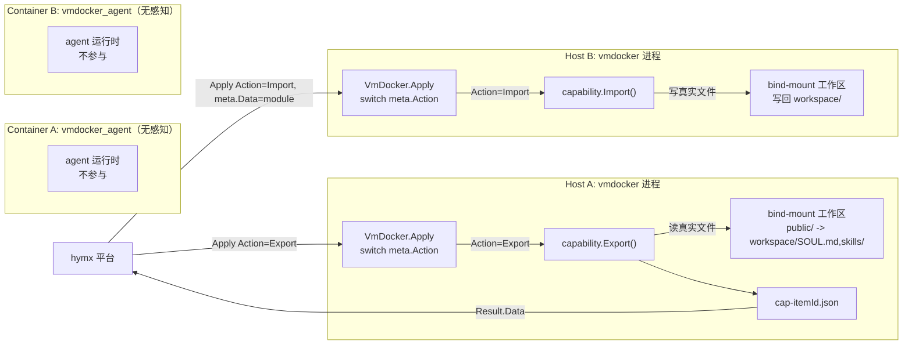
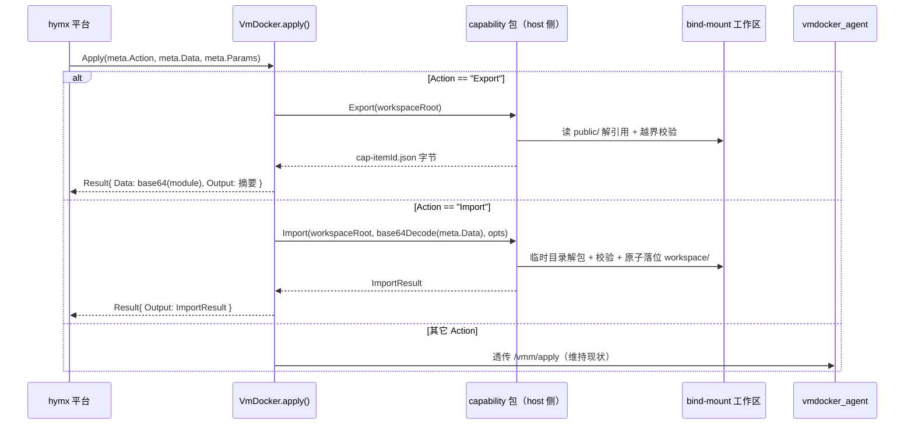
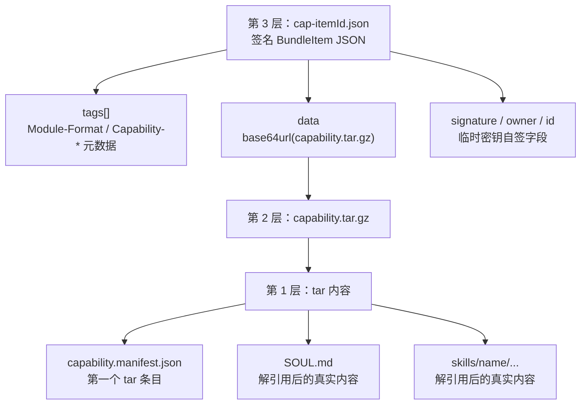

# vmdocker Agent 能力 Export / Import 架构设计

- 日期：2026-06-16
- 状态：已评审（v2，host 侧方案），待实现
- 涉及仓库：
  - `vmdocker`：host 侧编排、sandbox 目录布局、public/private 视图软链接、能力打包/解包/签名、触发分发
  - `vmdocker_agent`：**无改动**（对本功能完全无感知）

## 1. 一句话说明

能力 Export / Import 把一个 agent 的“可复刻能力”导出成一个本地 module 文件，再导入到另一个 agent，使目标 agent 获得相同的 `SOUL.md` 和 `skills/`。

导出内容只来自明确约定的 public 视图，不包含私有配置、会话状态、凭据或用户数据。

**核心架构决策（v2）**：整个功能在 `vmdocker`（host 侧）完成，`vmdocker_agent` 不参与、不感知。因为 sandbox 工作区是 host 目录 bind-mount 进容器的，vmdocker 直接读写真实文件即可，无需经过容器内服务。

## 2. 设计目标

### 2.1 要解决的问题

当前 agent 的能力主要沉淀在 workspace 内：

- `SOUL.md`：agent 的人格、原则、长期行为约束。
- `skills/`：agent 可复用的任务能力。

安全地打包和导入这些内容，可支持：

- 复制一个 agent 的能力到另一个 agent。
- 在不同 sandbox / 节点之间迁移能力。
- 后续把能力 module 接入已有 module 发布链路。

### 2.2 成功标准

1. 向 A 进程发 `Action: "Export"` 消息，能得到一个 `cap-<itemId>.json` 能力 module（经 `Result.Data` 回传）。
2. 向 B 进程发 `Action: "Import"` 消息（module 字节经 `meta.Data` 传入），能完成导入。
3. B 的 `workspace/` 中出现与 A 相同的 `SOUL.md` 和 `skills/` 真实文件。
4. 导出包**只**含 public 约定路径；任何 runtime 状态、凭据、HOME 或用户数据（无论 openclaw / claude code / hermes 等哪种 runtime）都不进包。
5. 导入过程能校验格式、manifest、sha256、路径越界和大小限制。
6. `vmdocker_agent` 代码、镜像、HTTP 接口均无任何改动。

### 2.3 非目标

- 不做 Arweave 实际上链；本期只生成本地 module 文件，上链走现有或未来流程。
- 不做 public/private 之外的细粒度权限或内容加密。
- 不做 CLI；触发统一走 VMM 的 `Apply` + `Action`。

## 3. 关键事实（为什么 host 侧可行）

| 事实 | 代码位置 | 含义 |
|---|---|---|
| sandbox 工作区是 host 目录 bind-mount 进容器，且容器内外同路径 | `runtimemanager/docker.go:303-304`（`mount.Mount{Source: workspace, Target: workspace}`） | vmdocker（host 进程）能直接读写 `SOUL.md`、`skills/`、`public/` 软链接 |
| 容器 `ReadonlyRootfs + CapDrop ALL`，唯一可写区即该 bind-mount | `runtimemanager/docker.go:260` 起 | 能力数据只可能落在 vmdocker 可直达的工作区里 |
| `public/`/`private/` 视图由 vmdocker 在 host 创建 | 本设计 §6（`env.go`） | “哪些可导出”的约定本就归 vmdocker，无需问 agent |
| `Checkpoint()` 已在运行时于 host 侧归档整个 workspace | `vmdocker.go:248` / `runtimemanager/env.go` | host 侧读写运行中工作区有先例，一致性模型可沿用 |
| vmdocker 已依赖 `hymx v0.4.8`、`goar v1.1.1`、`goether v1.2.0` | `vmdocker/go.mod` | 打包（`SaveModule`）、签名（BundleItem）所需依赖齐备 |

`Vm` 接口固定为 `Apply / Checkpoint / Restore / Close`（`hymx/vmm/schema/schema.go:33`），不能新增方法，因此触发只能挂在 `Apply` + `Action` 上。

## 4. 总体架构



职责划分：

| 层 | 组件 | 职责 |
|---|---|---|
| Host 编排层 | `vmdocker` | 建立目录布局与 public/private 视图；拦截 `Action=Export/Import`；在 host 侧打包/签名/校验/解包 |
| 容器服务层 | `vmdocker_agent` | **无改动、无感知** |

## 5. 触发与分发

触发统一为发往进程的一条带 `Action` 的 VMM 消息。`VmDocker.apply()` 现在无条件透传到容器 `/vmm/apply`（`vmdocker.go:641`）；改为先按 `meta.Action` 短路：



要点：
- Export/Import 命中即在 host 侧处理，**永不发往 agent**。
- 其它 Action 行为完全不变。
- Action 名称常量：`ActionExport = "Export"`、`ActionImport = "Import"`（大小写不敏感匹配，去空格）。
- `on_conflict` 等导入选项通过 `meta.Params`（如 `meta.Params["On-Conflict"] = "skip|overwrite|fail"`）传入。

### 5.1 输入 / 输出约定

| 操作 | 输入 | 输出（`vmmSchema.Result`） |
|---|---|---|
| Export | 无（约定路径固定） | `Result.Data = base64(cap-itemId.json)`；`Result.Output = { itemId, skills[], soul }` |
| Import | `meta.Data = base64(cap-itemId.json)`；`meta.Params["On-Conflict"]` | `Result.Output = ImportResult{ imported, skipped, skills, soul }` |
| 失败 | — | `Result.Error`（错误码见 §8） |

## 6. 目录视图设计（vmdocker 侧）

`vmdocker` 在 `sandbox_workspace/<pid>/` 下新增 `public/` 和 `private/` 两个视图目录，与 `workspace/` 平级，**只保存相对软链接**。

```text
sandbox_workspace/<pid>/
├── workspace/                 原文件真实存放处，VMDOCKER_AGENT_WORKSPACE
│   ├── SOUL.md                真实文件（agent 无关，可导出）
│   ├── skills/<name>/...      真实目录（agent 无关，可导出）
│   └── data/                  用户数据示例，不导出
├── public/                    可导出视图，只放相对软链接（导出白名单）
│   ├── SOUL.md  -> ../workspace/SOUL.md
│   └── skills   -> ../workspace/skills
├── private/                   不可导出视图，仅供检视（best-effort，按 runtime 实际存在的目录建链）
│   ├── runtime-state -> ../.openclaw   # openclaw 示例；claude code≈.claude、hermes 另有
│   ├── home          -> ../.home
│   ├── xdg           -> ../.xdg
│   └── data          -> ../workspace/data
├── .openclaw/ | .claude/ | ...   runtime 状态目录（随 runtime 不同而不同）
├── .home/
├── .tmp/
└── .xdg/
```

### 6.1 为什么使用软链接视图

1. 原文件仍留在 `workspace/`，不改变现有运行时读写习惯。
2. `public/` 是“导出允许列表”的可见表达，便于人和系统理解。
3. 相对软链接在 checkpoint/restore 或整体搬动 sandbox 后仍然有效。
4. `private/` 让敏感路径显式可见，便于检视；但它**不是安全边界**——见下方“白名单 ≠ 黑名单”。

> **vmdocker / vmdocker_agent 兼容多种 agent runtime（openclaw、claude code、hermes 等），不同 runtime 的状态/凭据目录各不相同。** 因此 private 清单只是 best-effort 的可视化，不假定枚举完整。

#### 白名单 ≠ 黑名单（关键安全语义）

导出的安全边界是 **public 白名单**：导出器只读 §6.2 public 约定路径，**其余一切默认私有、永不导出**——无论它在不在 `private/` 视图里、属于哪种 runtime。所以即使将来新增了某个 runtime 的新状态目录、且没来得及加进 private 视图，也绝不会被导出。`private/` 的作用是“让人看见有哪些敏感数据”，不是“枚举所有不可导出项”。

### 6.2 约定路径

public 是导出白名单，agent 无关：

| 视图 | 链接路径 | 目标路径 | 用途 |
|---|---|---|---|
| public | `public/SOUL.md` | `workspace/SOUL.md` | agent 人格与行为约束 |
| public | `public/skills` | `workspace/skills` | agent 能力集合 |

private 是 best-effort 检视视图，**仅对实际存在的目标建链**，可随支持的 runtime 扩展：

| 视图 | 链接路径 | 目标路径（示例） | 说明 |
|---|---|---|---|
| private | `private/runtime-state` | openclaw→`.openclaw`；claude code→`.claude`；hermes→其状态目录 | runtime 状态/凭据/session |
| private | `private/home` | `.home` | 容器 HOME |
| private | `private/xdg` | `.xdg` | XDG config/cache/state |
| private | `private/data` | `workspace/data` | 用户数据约定目录 |

### 6.3 env.go 改动

文件：`vmdocker/vmdocker/runtimemanager/env.go`

```go
const (
    publicViewDirName  = "public"
    privateViewDirName = "private"
)

type viewLink struct {
    Link   string // 相对 workspace 根
    Target string // 相对 workspace 根
}

// public 是导出白名单，agent 无关。
var publicConventionLinks = []viewLink{
    {"public/SOUL.md", "workspace/SOUL.md"},
    {"public/skills", "workspace/skills"},
}

// private 仅为检视便利，best-effort：目标不存在则跳过（见 ensureWorkspaceViews）。
// 跨 runtime：runtime 状态目录随 RUNTIME_TYPE 解析（openclaw=.openclaw、claude code=.claude…），
// 其余为 runtime 无关的通用沙箱目录。这里的 private 清单不需要、也不假定枚举完整——
// 安全边界由 public 白名单保证，不由 private 黑名单保证。
var privateCommonLinks = []viewLink{
    {"private/home", ".home"},
    {"private/xdg", ".xdg"},
    {"private/data", "workspace/data"},
}

// 按 RUNTIME_TYPE 返回该 runtime 的状态目录链接（不识别的 runtime 返回空，跳过即可）。
func privateRuntimeStateLink(runtimeType string) (viewLink, bool) {
    switch strings.ToLower(strings.TrimSpace(runtimeType)) {
    case "openclaw":
        return viewLink{"private/runtime-state", ".openclaw"}, true
    case "claude", "claudecode", "claude-code":
        return viewLink{"private/runtime-state", ".claude"}, true
    // hermes 等其它 runtime 在支持时补充
    default:
        return viewLink{}, false
    }
}
```

| 函数 | 行为 |
|---|---|
| `runtimeWorkspaceLayoutDirs(workspace)` | 追加创建 `public/`、`private/` |
| `ensureWorkspaceViews(workspace, runtimeType string) error` | 幂等建立约定软链接（public 全建；private = `privateCommonLinks` + 按 `runtimeType` 解析的 runtime 状态链接，仅对存在的目标建链） |
| `resolveWithinWorkspace(workspace, path string) (string, error)` | 解析路径并确认结果仍在 sandbox 根内 |
| `ensureRuntimeWorkspaceLayout` | 末尾调用 `ensureWorkspaceViews` |

`ensureWorkspaceViews` 必须保守：

- 目标不存在：跳过，不创建悬空链接。
- 链接已存在且指向正确：跳过。
- 链接已存在但指向错误：删除并重建。
- 同名位置是真实文件或目录：只 `log.Warn`，绝不覆盖。

> 导入流程只写 `workspace/` 下真实文件，**不建软链接**；`public/` 软链接由 vmdocker 下次 spawn 调用 `ensureWorkspaceViews` 自动重建。

## 7. 能力打包包（vmdocker 侧新增）

新增包 `vmdocker/vmdocker/capability/`（与 host 侧编排同仓），复用现有 module 链路：

`Artifact{ModuleBytes, Tags}` → `hymxSchema.Module` → `SaveModule`-等价逻辑 → 签名 `goarSchema.BundleItem` → JSON 字节。

> 注：`vmdocker_agent/modulegen` 是**镜像** module（`docker save`），与本包是两个独立关注点，保持不动。本包只处理能力 tar + BundleItem，不依赖 docker。

### 7.1 Module 文件三层结构

落盘/回传文件名：`cap-<itemId>.json`，与镜像 module 的 `mod-<id>.json` 区分。



### 7.2 BundleItem tags

经 `hymxSchema.Module` + `hymxUtils.ModuleToTags` 生成：

| Tag Name | 值 |
|---|---|
| `Data-Protocol` | `hymx` |
| `Variant` | `v0.1.0` |
| `Type` | `Module` |
| `Module-Format` | `hymx.vmdocker.capability.v0.0.1` |
| `Capability-Source` | `public-workspace` |
| `Capability-Manifest-SHA256` | manifest 的 sha256 hex |
| `Capability-Skills` | 逗号分隔 skill 名，便于不解包预览 |
| `Capability-Created-At` | RFC3339 |

### 7.3 capability.manifest.json

tar 内第一个条目，便于导入端先做结构校验。

```json
{
  "format": "hymx.vmdocker.capability.v0.0.1",
  "created_at": "2026-06-16T12:00:00Z",
  "soul":   { "path": "SOUL.md", "sha256": "...", "size": 1234 },
  "skills": [
    { "name": "code-review",
      "files": [ { "path": "skills/code-review/SKILL.md", "sha256": "...", "size": 1234 } ] }
  ],
  "entries": [ { "path": "SOUL.md", "type": "file", "sha256": "...", "size": 1234 } ]
}
```

- `entries[]`：**全量**文件清单（含每个 skill 内全部文件），导入端逐条 sha256 比对。
- `soul` / `skills`：结构化展示视图。

### 7.4 常量与接口

```go
package capability

const (
    ModuleFormat       = "hymx.vmdocker.capability.v0.0.1"
    SourceTag          = "Capability-Source"
    SourceValue        = "public-workspace"
    ManifestSHATag     = "Capability-Manifest-SHA256"
    SkillsTag          = "Capability-Skills"
    CreatedAtTag       = "Capability-Created-At"
    DefaultMaxBytes    = 64 << 20 // 64 MiB
)

type ExportResult struct {
    ItemId      string   `json:"itemId"`
    ModuleBytes []byte   `json:"-"`     // cap-<itemId>.json 字节
    Skills      []string `json:"skills"`
    Soul        bool     `json:"soul"`
}

type ImportOptions struct {
    OnConflict string // "skip"(默认) | "overwrite" | "fail"
    MaxBytes   int64  // 0 → DefaultMaxBytes
}

type ImportResult struct {
    Imported []string `json:"imported"`
    Skipped  []string `json:"skipped"`
    Skills   []string `json:"skills"`
    Soul     bool     `json:"soul"`
}

// 读 public/ 约定路径，解引用 + 校验 + 打包 + 签名
func Export(workspaceRoot string) (ExportResult, error)

// 解析 BundleItem → 校验 → 解包写回 workspace/
func Import(workspaceRoot string, moduleBytes []byte, opts ImportOptions) (ImportResult, error)
```

### 7.5 Export 流程（三重过滤）

`workspaceRoot` = `sandbox_workspace/<pid>`（vmdocker 已持有，见 `vmdocker.go:861`）。

1. **约定清单**：只遍历约定 public 入口（`public/SOUL.md`、`public/skills`），**不盲目 tar 整个 `public/`**——即使 public 里被塞了额外软链接也不进包。
2. **解引用**：`os.Readlink` 跟随软链接读真实内容。
3. **越界校验**：每个解引用目标必须经 `resolveWithinWorkspace` 落在 `workspaceRoot` 内，否则整体失败（`PATH_ESCAPE`）。

随后：流式遍历真实内容算每文件 sha256 → 构建 manifest（manifest 先入 tar）→ gzip → 组装 tags（§7.2）→ `SaveModule`-等价逻辑签名（密钥见 §9）→ 返回 `ExportResult`。

### 7.6 Import 流程

1. `json.Unmarshal(moduleBytes, &goarSchema.BundleItem{})`。
2. `tags = arutils.TagsDecode(item.Tags)` → `hymxUtils.TagsToModule(tags)` → 断言 `Module-Format == ModuleFormat`，否则 `FORMAT_MISMATCH`。
3. `tarGz = arutils.Base64Decode(item.Data)`；`len ≤ MaxBytes`，否则 `TOO_LARGE`。
4. gunzip → 读第一个 tar 条目 `capability.manifest.json` → 校验其 sha256 == tag `Capability-Manifest-SHA256`，否则 `MANIFEST_MISMATCH`。
5. 解包到临时目录 `workspace/.import-<ts>/`：
   - 路径净化：拒绝绝对路径、`..`、tar 内 symlink 条目；目标 = `Join(workspaceRoot,"workspace",entry.path)`，再次确认在 `workspace/` 内（否则 `PATH_ESCAPE`）。
   - 写**真实文件**，边写边算 sha256，与 manifest `entries[]` 比对，不符则整体失败回滚。
6. 冲突策略 `opts.OnConflict` 针对 `workspace/` 既有路径：`skip`（默认）/ `overwrite` / `fail`。
7. 全量校验通过后，按策略原子 `rename` 落位到 `workspace/`；删除临时目录。
8. **不建软链接**（见 §6.3 说明）。返回 `ImportResult`。

## 8. 错误码

| 码 | 触发 | 建议处理 |
|---|---|---|
| `FORMAT_MISMATCH` | `Module-Format` 非能力 module | 拒绝导入 |
| `TOO_LARGE` | 解码后 payload 超 `MaxBytes` | 拒绝导入 |
| `MANIFEST_MISMATCH` | manifest sha256 或逐文件 sha256 不符 | 拒绝并回滚 |
| `PATH_ESCAPE` | 软链接/解包目标越出 workspace | 拒绝并回滚 |
| `CONFLICT` | `OnConflict=fail` 且存在冲突 | 返回冲突清单 |

错误统一经 `vmmSchema.Result.Error` 回传。

## 9. 安全与边界

- **路径穿越**：软链接解引用与 tar 解包目标都过 `resolveWithinWorkspace` 白名单；拒绝绝对路径软链接、`../` 越界、tar 内 symlink 条目。
- **白名单边界（非黑名单）**：导出器只认 public 约定清单，其余一切默认私有、永不导出——与是哪种 runtime（openclaw/claude code/hermes…）、是否出现在 `private/` 视图无关。新增 runtime 的状态目录即便未登记进 private 视图，也不会泄露。
- **不覆盖真实文件**：建视图遇同名真实文件 → warn 跳过。
- **大小限制**：导入 `MaxBytes`（默认 64 MiB，可由 `VMDOCKER_CAPABILITY_MAX_BYTES` 覆盖），防 zip-bomb。
- **原子性**：导入先写临时目录、全量 sha256 校验通过后再 rename；任一步失败整体回滚。
- **导出签名**：临时密钥自签（决策 D-1）。沙箱/host 无需预置密钥；若配置 `VMDOCKER_MODULE_SIGNER_KEY` 则用之。导入端**不强校验签名**（可移植格式，非共识对象），只校验 `Module-Format` + manifest sha256。
- **运行时一致性**：host 读运行中工作区，与现有 `Checkpoint()` 同源；`SOUL.md`/`skills` 基本静态，语义为“调用时刻快照”。

## 10. 测试

- `vmdocker/vmdocker/runtimemanager/env_test.go`
  - 视图目录创建；软链接为相对路径且指向正确；幂等。
  - 同名位置是真实文件时不覆盖、仅 warn；目标不存在时跳过、不建悬空链接。
  - `resolveWithinWorkspace` 越界目标被拒。
- `vmdocker/vmdocker/capability/capability_test.go`
  - 导出只含约定内容；软链接解引用正确；恶意越界软链接被拒；`private/` 不进包。
  - manifest sha256 与文件内容一致；tags 正确。
  - 导入：还原真实文件；`skip`/`overwrite`/`fail` 三策略；`TOO_LARGE`/`FORMAT_MISMATCH`/`MANIFEST_MISMATCH`/`PATH_ESCAPE`。
  - **round-trip**：export → import 后两侧 `workspace/` 内容字节一致。
- `vmdocker/vmdocker/vmdocker_test.go`（或 apply 专项测试）
  - `Apply(Action=Export)` 返回合法 BundleItem 字节于 `Result.Data`，且**不触达** `/vmm/apply`。
  - `Apply(Action=Import, meta.Data=...)` 正确解包；各错误码经 `Result.Error` 回传。
  - 其它 Action 仍透传到 `/vmm/apply`（回归）。

## 11. 实施顺序

1. vmdocker：目录布局 + 视图软链接（§6.3）+ 测试。
2. vmdocker：`capability` 包 Export/Import（§7）+ 单测（含 round-trip）。
3. vmdocker：`apply()` 加 `Action=Export/Import` 分发分支（§5）+ apply 测试。
4. 端到端：A 导出 → B 导入 → B 工作区复刻验证。

## 12. v1 → v2 变更摘要

| 项 | v1（agent 侧） | v2（host 侧，本版） |
|---|---|---|
| 打包代码位置 | `vmdocker_agent/modulegen` | `vmdocker/capability`（新包） |
| 触发 | agent `/vmm/export`、`/vmm/import` HTTP 端点 | `vmdocker.apply()` 拦截 `Action=Export/Import` |
| agent 改动 | 新端点 + 处理逻辑 | **零，完全无感知** |
| 输入/输出 | HTTP body | `meta.Data` / `Result.Data` |
| 容器停止时可导出 | 否 | 是（纯 host FS） |
| 触发缺口 | 有（独立端点无标准上游触发） | 无（挂在标准 Apply 上） |
