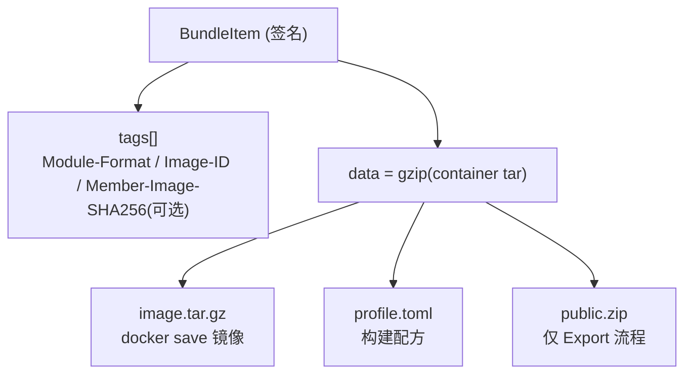
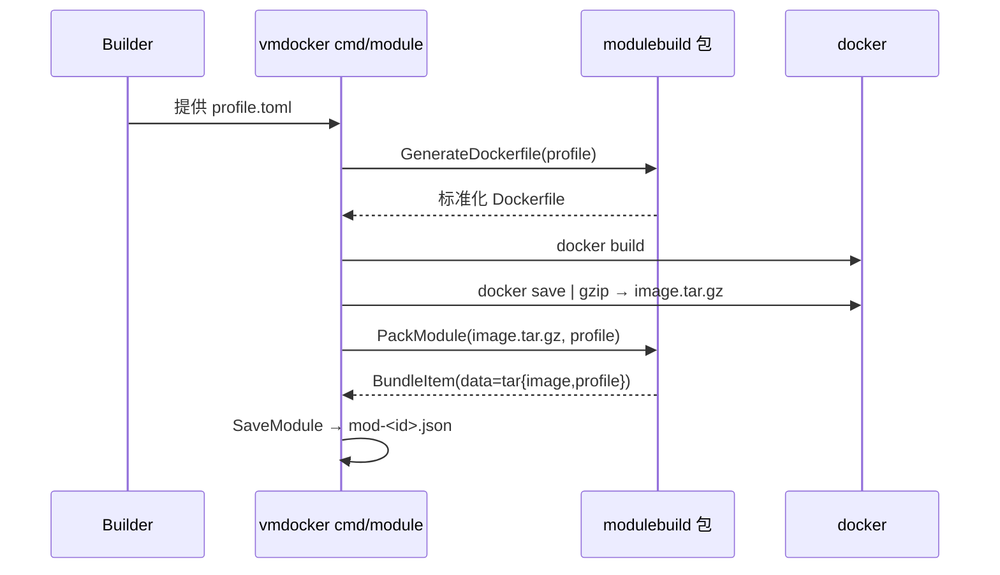
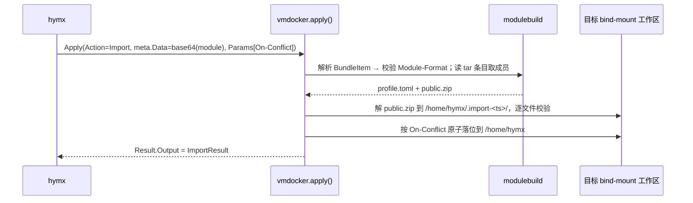
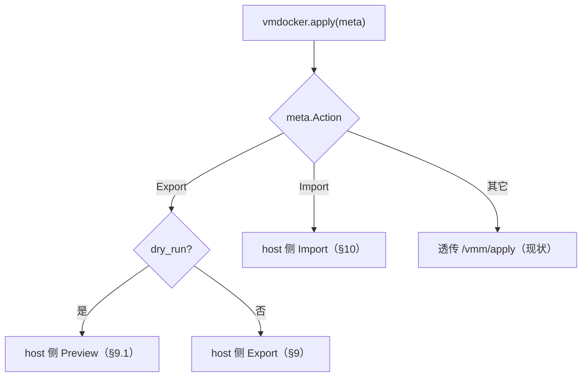

# vmdocker Agent Profile / Module 构建与 Export / Import 架构设计

- 日期：2026-06-16
- 状态：已评审（v3，profile 驱动），待实现
- 涉及仓库：
  - `vmdocker`：**本功能的唯一实现工程**——host 侧编排、docker 生命周期、profile→Dockerfile→build→module 全套构建、离线构建 CLI、运行时 Export/Import/Preview
  - `vmdocker_agent`：容器内 `/vmm` 运行时适配器，**独立编译成一个可执行文件**；由 vmdocker 构建时按 `FROM`/`RUNTIME_TYPE` 自动注入镜像（**B2 平台注入**）。是**预编译 binary 产物**，非 vmdocker 的源码依赖；对本功能无感知
- 架构选择：**B + B2**——vmdocker 工程自包含（不含 agent 源码），agent 适配器以 binary + `/vmm` 协议松耦合、由平台注入（详见 §4.1）

## 1. 一句话说明

围绕一份**声明式 Profile** 标准化地生成 Dockerfile、构建镜像，并打包成一个**统一 Module**（内含镜像 + profile，Export 时再加 public.zip）。

- **构建 module**（离线工具）：profile → 标准化 Dockerfile → 构建镜像 → 打包 `image + profile`。
- **Export**（运行时）：对一个运行中的 agent，导出 public→zip + profile → 重新生成 Dockerfile → 构建镜像 → 打包 `image + profile + public.zip`。
- **Import**（运行时）：取 module 内的 `public.zip + profile`，**解包覆盖**到另一个已运行 agent 的 workspace，实现能力复刻。

兼容多种 agent runtime（openclaw、hermes、claude code 等），通过 profile 的 `base` 字段选择。

## 2. 设计目标

### 2.1 要解决的问题

- 让 agent 镜像的构建**标准化、可声明**：用户只描述意图（基础镜像、bin、工具、public、startup、自定义 RUN），系统生成统一、加固的 Dockerfile。
- 让一个 agent 的**能力可被复刻**：把 public 目录（如 `skills/`、`persona/`）+ 构建配方打包，导入到另一个 agent。
- 让构建产物成为**自包含、可移植的 module**：携带镜像（可直接 run 出全新 agent）+ profile（可重建）+ public.zip（可覆盖导入）。

### 2.2 成功标准

1. 给定一份 profile，离线工具生成标准化 Dockerfile、构建镜像、产出含 `image + profile` 的 module。
2. 标准化 Dockerfile 始终注入约定加固：固定用户 `hymx`、仅 `HOME=/home/hymx` 可访问、profile 被 copy 进镜像。
3. 向运行中 agent 发 `Action=Export`，得到含 `image + profile + public.zip` 的 module。
4. 发 `Action=Export, dry_run=true`，得到将打包内容的预览清单（目录/文件/大小/sha256），不触发 docker build、不产 module（§9.1）。
5. 向另一个运行中 agent 发 `Action=Import`（module 经 `meta.Data` 传入），其 HOME 出现与来源相同的 public 目录内容。
6. Export 只导出 `[vmdocker].public` 声明的目录；runtime 状态、凭据、HOME 其余内容、用户数据一律不导出。
7. `vmdocker_agent` 无任何源码改动；作为预编译 binary 由 vmdocker 构建时注入镜像（§4.1、§6）。

### 2.3 非目标

- 不做 Arweave 实际上链；本期只生成本地 module 文件。
- 不做 public 之外的细粒度权限或内容加密。
- profile 的**编辑/上传界面**（前端/控制台）不在本 spec；本 spec 只定义 profile schema 与消费它的构建/导出/导入流程。

## 3. 核心概念

| 概念 | 定义 |
|---|---|
| **Profile** | 一份声明式 JSON，描述如何标准化构建一个 agent 镜像（§5）。是 module 的一等成员。 |
| **标准化 Dockerfile** | 由 profile 确定性生成的 Dockerfile，叠加用户不可见的约定加固（§6）。 |
| **Module** | 统一载体：一个签名 BundleItem，其 `data` 是一个容器 tar，成员为 `image.tar.gz` + `profile.toml`（+ Export 时 `public.zip`）（§7）。 |
| **public** | 由 `[vmdocker].public` **目录**清单定义的可导出内容；profile 即唯一真相，无软链接视图（§11）。 |
| **agent 适配器** | 容器内提供 `/vmm/*`、按 `RUNTIME_TYPE` 驱动 openclaw/claude/hermes 引擎的可执行文件（当前即 `vmdocker_agent` 编译产物）。由 vmdocker 构建时按 `FROM` 平台注入（§4.1）。 |

## 4. 关键事实与依据

| 事实 | 代码位置 | 含义 |
|---|---|---|
| host 已持有 docker 构建/保存能力 | `vmdocker_agent/modulegen/modulegen.go`（`dockerBuild`/`exportImageArchive`） | profile→build→save 逻辑可直接迁入 host vmdocker |
| host 已管理 docker 生命周期 | `vmdocker/vmdocker/runtimemanager/docker.go`（`DockerManager`） | 运行时 Export 在 host 侧 build 镜像有原生支撑 |
| sandbox 工作区 bind-mount 进容器，host 可直读写 | `runtimemanager/docker.go:303-304` | Export/Import 可在 host 侧直接读写 public/profile，agent 无感知 |
| 两仓互不 import | `vmdocker/go.mod`、`vmdocker_agent/go.mod` | 共享构建逻辑需明确归属——**决策：收拢于 host vmdocker**（§13） |
| 现有 Dockerfile 模板与加固 | `Dockerfile.openclaw` / `Dockerfile.claude` | 标准化 Dockerfile 以其为蓝本参数化（§6） |
| `Vm` 接口固定为 Apply/Checkpoint/Restore/Close | `hymx/vmm/schema/schema.go:33` | 运行时 Export/Import 只能挂在 `Apply` + `Action`（§10） |
| agent 是 `/vmm` 适配器（`main.go`→`server.New(8080)`，`runtime/` 按 `RUNTIME_TYPE` 分派） | `vmdocker_agent/main.go`、`server/api.go`、`runtime/` | 一个 binary 通吃所有 base；作为预编译产物注入即可，无需源码耦合 |

### 4.1 职责分工、位置与工作流（架构 B + B2）

**职责与运行时位置**（构建期/运行期）：

| | `vmdocker`（host 进程） | `vmdocker_agent`（容器内适配器 binary） |
|---|---|---|
| 构建期 | profile→Dockerfile→docker build→save→pack module→签名；**按 `FROM` 把平台 agent 适配器 binary 注入镜像** | 不参与（其 binary 被注入） |
| 运行期·编排 | 容器生命周期、workspace bind-mount、env、对上说 VMM、对下调 `/vmm/*` | 提供 `/vmm/*`(8080)，按 `RUNTIME_TYPE` 驱动引擎 |
| 运行期·普通消息 | `Apply` 透传 `/vmm/apply` | 处理 spawn/apply/checkpoint/restore |
| Export/Import/Preview | `Apply(Action)` **host 侧拦截处理** | **永不触达**（无感知） |

**耦合面**：vmdocker 与 agent 仅通过 **① 一个预编译 binary ② `/vmm` HTTP 协议** 松耦合，各自独立发版。vmdocker 工程不含 agent 源码。

**镜像内适配器来源（B2 平台注入）**：`profile.bin` 只承载**用户自己的可执行文件**；agent 适配器 binary 由 vmdocker 构建按 `FROM`/`RUNTIME_TYPE` 自动注入（版本随平台管理），用户不需在 profile 里管它。

**端到端工作流顺序**：

```
0. [带外·偶尔发版] vmdocker_agent 编译 → 平台 agent 适配器 binary（按 runtime 各一份或单 binary 多分派）
1. 备好 profile.toml（[dockerfile] FROM/bin/tools/RUN/ENTRYPOINT + [vmdocker] public）；bin/ 仅放用户程序
2. vmdocker cmd/module：profile→标准化 Dockerfile（注入平台 adapter binary + COPY 用户 bin/）→docker build→save→pack → module(image+profile)
3. vmdocker spawn 容器：ENTRYPOINT 启动适配器 → /vmm 就绪
4. hymx→vmdocker.Apply→普通消息透传 agent；agent 驱动引擎
5. Export/Import/Preview：vmdocker.Apply(Action) host 侧拦截，产/收 module，全程不碰 agent
```

## 5. Profile 规范

profile 为 **TOML** 文件（`profile.toml`），用配置段区分「Dockerfile 构建配置」与「vmdocker 配置」。

### 5.1 用户可见配置

`[dockerfile]` 段的 key **直接采用 Dockerfile 指令名**（即所写即所生成），便于理解：

```toml
[dockerfile]
FROM       = "openclaw"                     # 基础镜像别名：openclaw | hermes | claude（解析见 §5.3）
bin        = "bin"                          # 便捷键：可执行程序目录（整目录 COPY + chmod +x，标准化到 /usr/local/bin）
tools      = ["curl", "ripgrep", "jq"]      # 便捷键：要安装的工具（展开为跨发行版 RUN 安装）
RUN        = ["pip install --no-cache-dir foo"]  # 自定义 RUN（值不含 RUN 前缀，生成器逐条加 RUN）
ENTRYPOINT = "startup.sh"                   # 上传的 ENTRYPOINT 脚本（包内相对路径）

[vmdocker]
public = ["skills", "persona"]              # 可导出目录清单（导出白名单）。默认只支持目录
```

- **两类 key**：
  - **指令键（大写，= 字面 Dockerfile 指令）**：`FROM`、`RUN`、`ENTRYPOINT`，值即该指令的参数（不含指令前缀）。
  - **便捷键（小写，vmdocker 展开为指令）**：`bin`（→ `COPY` + `chmod +x`）、`tools`（→ 跨发行版安装 `RUN`），因含标准化/加固处理而单列。
- **`bin` 是目录**：放可执行程序的标准化目录，整目录 `COPY` 进镜像、`chmod +x`、标准化到 `/usr/local/bin`；`ENTRYPOINT` 脚本启动其中的程序。
- **`public` 只放目录**：每项是**相对 HOME 的目录**路径；导出时按目录结构压成 `public.zip`，导入时**直接解压到 `/home/hymx`**，还原同样的目录结构。默认只支持目录——若要携带单文件，置于某个 public 目录内。
- **分段语义**：`[dockerfile]` 段只喂给 Dockerfile 生成器（§6）；`[vmdocker]` 段只喂给运行时 Export/Import（§9/§10）。两段互不串用。

### 5.2 约定注入（用户不可见，构建器强制写入/校验）

```toml
[convention]            # 不在用户编写的文件里，由构建器强制注入并校验
user   = "hymx"         # 固定运行用户
home   = "/home/hymx"   # 唯一可访问目录
harden = ["去除 sudo/docker 组", "rm /etc/sudoers.d/*", "禁止 passwordless sudo"]
```

- **固定用户 `hymx`**：标准化 Dockerfile 以 `USER hymx`、`WORKDIR /home/hymx` 结束（替换现有模板的 `agent`/`/workspace`）。
- **仅 HOME 可访问**：工作区、state、tmp、xdg 全部归置到 `/home/hymx` 下；配合 host 侧 `ReadonlyRootfs` + bind-mount 单目录。
- **profile copy 进镜像**：`COPY profile.toml /home/hymx/profile.toml`（HOME 根目录，不嵌套）。host 侧 spawn 时把它种入工作区（bind-mount 会遮蔽镜像内 HOME），使运行时与 Export 都能读到构建配方。

### 5.3 FROM 解析

`FROM` 取**别名**（非任意镜像），映射到一组基础镜像 + runtime 装配（以现有 Dockerfile 为蓝本）：

| FROM | 基础镜像 / 装配 | RUNTIME_TYPE |
|---|---|---|
| `openclaw` | `ghcr.io/openclaw/openclaw` + `docker/sandbox-templates:shell` | `openclaw` |
| `hermes` | hermes 基础镜像（待补） | `hermes` |
| `claude` | `docker/sandbox-templates:claude-code` | `claude` |

## 6. 标准化 Dockerfile 生成

仅消费 `[dockerfile]` 段，确定性渲染成多阶段 Dockerfile（以 `Dockerfile.openclaw` 为参数化蓝本）。指令键原样映射到 Dockerfile 指令；便捷键 `bin`/`tools` 由生成器展开：

```dockerfile
# 1) base 阶段：[dockerfile].FROM 别名 → 实际基础镜像（§5.3）
FROM {{.ResolvedFROM}}
USER root
WORKDIR /app

# 2) 平台注入 agent /vmm 适配器 binary（B2，按 FROM/RUNTIME_TYPE 选）
COPY {{.PlatformAgentBin}} /usr/local/bin/vmdocker-agent

# 3) 用户 bin 目录整目录 COPY + chmod；启动脚本；profile
COPY {{.Bin}}/ /usr/local/bin/
RUN chmod +x /usr/local/bin/*
COPY {{.ENTRYPOINT}} /usr/local/bin/start-vmdocker-agent.sh
COPY profile.toml /home/hymx/profile.toml

# 4) tools 便捷键 → 跨发行版安装
RUN install {{.Tools}}

# 5) 约定加固（不可见）：建 hymx 用户、去 sudo/docker 组、清 sudoers
RUN useradd hymx ...; gpasswd -d hymx sudo || true; rm -f /etc/sudoers.d/*

# 6) [dockerfile].RUN 逐条加 RUN 前缀（值本身不含前缀）
{{range .RUN}}RUN {{.}}
{{end}}

# 7) 收尾：权限、属主、约定环境
RUN chmod +x /usr/local/bin/start-vmdocker-agent.sh; chown -R hymx:hymx /home/hymx /app
ENV HOME=/home/hymx
ENV RUNTIME_TYPE={{.RuntimeType}}
USER hymx
WORKDIR /home/hymx
ENTRYPOINT ["/usr/local/bin/start-vmdocker-agent.sh"]
```

要点：
- **平台注入适配器（B2）**：段 2 由 vmdocker 构建**无条件注入**平台维护的 agent `/vmm` 适配器 binary（按 `FROM`/`RUNTIME_TYPE` 选择，来源见下）。不占用 profile，用户无需管。
- **指令键即所写即所生成**：`RUN`/`ENTRYPOINT`/`FROM` 与 Dockerfile 同名；`RUN` 值不含 `RUN ` 前缀，生成器逐条补。
- **`bin` 为用户目录**：只放**用户自己的**可执行文件，整目录 COPY 到 `/usr/local/bin/` 并 `chmod +x`；`ENTRYPOINT` 脚本启动所需程序（适配器已在 `/usr/local/bin/vmdocker-agent`）。
- 加固段（5、7）由构建器无条件注入，profile 不能关闭。
- 用户 `RUN`（段 6）在加固之后、收尾之前插入，避免重新打开 sudo 等。
- 构建器校验 `ENTRYPOINT` 脚本可执行与基本安全（不强行覆盖现有 entrypoint 契约）。

**平台 adapter binary 来源**：vmdocker 从一份按 `FROM`/`RUNTIME_TYPE` 索引的**预编译产物**取用（如内置/发布制品或已知路径），版本随 vmdocker 平台管理；`vmdocker_agent` 仓负责产出该 binary，二者以 binary + `/vmm` 协议解耦（§4.1）。

## 7. Module 文件格式

一个签名 `goarSchema.BundleItem`，落盘 `mod-<itemId>.json`（构建）/ 经 `Result.Data` 回传（Export）。

### 7.1 多负载：data = 容器 tar

BundleItem 只有一个 `data` 字段，因此 `data = gzip(tar)`，成员名固定：



### 7.2 tags

经 `hymxSchema.Module` + `hymxUtils.ModuleToTags`：

| Tag | 值 |
|---|---|
| `Data-Protocol` | `hymx` |
| `Variant` | `v0.1.0` |
| `Type` | `Module` |
| `Module-Format` | `hymx.vmdocker.module.v0.0.1` |
| `Image-Name` / `Image-ID` | docker 镜像名与 ID（镜像内容标识） |
| `Member-Image-SHA256` | image.tar.gz 归档 sha256（**可选**，仅作缓存/去重键、`docker load` 前预检） |
| `Capability-Public` | profile.public 路径，逗号分隔，便于预览 |

> **成员由容器 tar 的条目列表枚举**（无需 `Module-Members` 标签）；**完整性靠 gzip 解码 + DataItem 签名**（覆盖 data+tags），故不再打 `profile`/`public` 的 per-member sha 与 `module.manifest.json`。容器 tar 内只放成员本身（`image.tar.gz` / `profile.toml` / `public.zip`）。
| `Created-At` | RFC3339 |

## 8. 构建 module 流程（离线工具）

入口：host vmdocker 的离线 CLI（`vmdocker/cmd/module`，由现 `vmdocker_agent/cmd/module` 迁移而来）。



1. 读 profile → `GenerateDockerfile`。
2. `docker build`（复用现有 `dockerBuild`）。
3. `docker save | gzip` → `image.tar.gz`（复用现有 `exportImageArchive`）。
4. 组装容器 tar：`image.tar.gz` + `profile.toml`（无 public）；可选记 `Member-Image-SHA256`。
5. `SaveModule` 签名 → `mod-<id>.json`。

## 9. Export 流程（运行时，host 侧）

触发：对运行中 agent 发 `Apply(Action=Export)`，由 `vmdocker.apply()` 短路、host 侧处理（§10）。

```mermaid
sequenceDiagram
    participant H as hymx
    participant V as vmdocker.apply()
    participant FS as bind-mount 工作区
    participant MB as modulebuild
    participant D as docker

    H->>V: Apply(Action=Export)
    V->>FS: 读 profile.toml（HOME 根 = bind-mount 工作区根）
    V->>FS: 就地读 [vmdocker].public 目录 + 越界校验 → public.zip
    V->>MB: GenerateDockerfile(profile)
    V->>D: docker build + docker save → image.tar.gz
    V->>MB: PackModule(image, profile, public.zip)
    MB-->>V: BundleItem
    V-->>H: Result.Data = base64(mod bytes); Result.Output = 摘要
```

1. 读取该实例 HOME 根的 `profile.toml`（构建时 copy 进镜像、spawn 时种入工作区）。
2. 按 `[vmdocker].public` **就地读取目录**（默认只支持目录），目录内若含软链接则 `resolveWithinHome` 越界校验（§14），按目录结构打成 `public.zip`（zip 内路径相对 HOME）。
3. `GenerateDockerfile(profile)` → `docker build` → `docker save` → `image.tar.gz`（复用 §8 同一套 `modulebuild`）。
4. 组装容器 tar：`image.tar.gz` + `profile.toml` + `public.zip`；可选记 `Member-Image-SHA256`。
5. 签名 → 经 `Result.Data` 回传。

> Export 重建镜像，确保导出的镜像嵌入最新 public 内容；语义为“调用时刻快照”，与现有 `Checkpoint()` host 侧归档同源。

### 9.1 导出预览（dry-run）

在真正导出（含最贵的 docker build）之前，让调用方先核对"将打包哪些目录/文件"。预览只跑 Export 的**收集阶段**（上面第 1–2 步），**跳过生成 Dockerfile / build / save / pack / 签名**。

**触发**：`Apply(Action=Export, meta.Params["dry_run"]="true")`——与导出同一 Action 的两个深度，命中 dry_run 即走预览分支。

**返回**（`Result.Output`，不产 module、不签名、无 `Result.Data`）：

```json
{
  "public": ["skills", "persona"],
  "entries": [
    { "path": "skills/code-review/SKILL.md", "size": 1234, "sha256": "..." }
  ],
  "total_files": 12,
  "total_bytes": 45678,
  "warnings": ["skills/x 指向 HOME 外的软链接，将被拒绝"]
}
```

**实现**：把收集逻辑抽成共用函数，Export 与 Preview 复用，Preview 不往下走：

```go
// capability 包
type PublicEntry struct{ Path string; Size int64; SHA256 string }
type Collection struct{ Public []string; Entries []PublicEntry; TotalBytes int64; Warnings []string }

// 遍历 [vmdocker].public 目录、算 sha256、resolveWithinHome 越界校验（不打 zip）
func CollectPublic(home string, public []string) (Collection, error)

func Preview(home string, public []string) (Collection, error)        // 仅收集，直接返回
func Export(home string, profile Profile) (ExportResult, error)        // CollectPublic → zip → build → pack
```

越界软链接在预览里记入 `warnings`（不报错中断），便于用户先看清；真正 Export 时则按 §14 拒绝。预览廉价、无副作用，可随时多次调用。

## 10. Import 流程（运行时，host 侧）

触发：对目标 agent 发 `Apply(Action=Import)`，module 字节经 `meta.Data`（base64）传入。**只用 module 里的 `public.zip + profile`，不使用其中镜像**（复刻 = 覆盖到已有 agent）。



1. `BundleItem` 反序列化 → `TagsToModule` 断言 `Module-Format == hymx.vmdocker.module.v0.0.1`（否则 `FORMAT_MISMATCH`）。
2. 解容器 tar（读 tar 条目即得成员，无需 `Module-Members`），取 `profile.toml` 与 `public.zip`（缺 public → `NO_PUBLIC`）；gzip/tar/zip 解码失败即视为损坏 → `CORRUPT`。
3. `len(public.zip) ≤ MaxBytes`（默认 64 MiB，`VMDOCKER_CAPABILITY_MAX_BYTES` 可覆盖，否则 `TOO_LARGE`）。
4. 解到临时目录 `/home/hymx/.import-<ts>/`：路径净化（拒绝绝对路径、`..`、zip 内 symlink），目标确认在 HOME（`/home/hymx`）内（`PATH_ESCAPE`）。
5. 冲突策略 `meta.Params["On-Conflict"]`：`skip`（默认）/ `overwrite` / `fail`。
6. 全量校验通过 → 原子 `rename` 落位到 `/home/hymx`（按 public 目录结构还原）。可选：用导入的 `profile.toml` 更新目标 HOME 根的 `profile.toml`（便于目标下次 Export 携带新 public 定义）。
7. 落位即真实目录到 HOME，**无任何视图需重建**（§11）。返回 `ImportResult{imported, skipped, public, profileUpdated}`。

## 11. public / private 语义（无软链接视图）

**不维护 `public/`、`private/` 软链接目录。** profile 的 `[vmdocker].public` 即唯一真相，没有需要同步的视图。

```text
/home/hymx/                    HOME 根 = bind-mount 工作区根（agent 的全部私有空间）
├── profile.toml               构建配方
├── skills/                    [vmdocker].public 项（就地真实目录）
├── persona/                   [vmdocker].public 项（就地真实目录）
└── .openclaw/|.claude/... .home .tmp .xdg .data   其余皆私有
```

- **public = `[vmdocker].public` 目录清单**：export 就地读这些目录打 zip，**不搬动原文件**、不建任何视图。
- **private = HOME 本身**：HOME 内**除 `[vmdocker].public` 之外的一切**默认私有、永不导出。private 不是一个目录、不需枚举、不需维护。
- **白名单 ≠ 黑名单**：导出边界是 `[vmdocker].public` 这个白名单。与是哪种 runtime、HOME 里有什么状态目录无关——新增 runtime 的状态目录天然落在"非 public"里，不会泄露。
- 原"`ensureWorkspaceViews` 维护软链接"的逻辑**取消**，`env.go` 无新增视图代码。
- 唯一保留的相关安全约束：打 zip 时 public 目录**内部**若含软链接，须 `resolveWithinHome` 校验、拒绝指向 HOME 外的链接（§14 路径穿越）。

## 12. 触发与分发

`vmdocker.apply()` 现无条件透传 `/vmm/apply`（`vmdocker.go:641`）；改为先按 `meta.Action` 短路：



- `ActionExport="Export"`、`ActionImport="Import"`（大小写不敏感）。命中即 host 侧处理，**永不发往 agent**。
- `Action=Export` 时再看 `meta.Params["dry_run"]`：为真走 Preview（§9.1，仅 `Result.Output`），否则走完整 Export。
- 输入/输出：Export `Result.Data` 出、Preview 仅 `Result.Output`；Import `meta.Data` 入、`Result.Output` 出；错误经 `Result.Error`（错误码见 §13）。

## 13. 代码归属与重构（B + B2：vmdocker 工程自包含）

本功能全部落在 `vmdocker`；`vmdocker_agent` 作为**预编译 adapter binary** 由构建注入，非源码依赖（§4.1）。

| 现状（vmdocker_agent） | 目标（vmdocker） |
|---|---|
| `modulegen/`（docker build/save、pull、tags） | 迁入 `vmdocker/vmdocker/modulebuild/`，扩展 profile→Dockerfile 生成（含 B2 注入 adapter）+ 多负载打包 |
| `cmd/module`（离线 CLI） | 迁入 `vmdocker/cmd/module`，消费 `modulebuild` |
| —（无） | 新增 `vmdocker/vmdocker/capability/`：`CollectPublic` / `Preview` / public.zip 打包/解包、Import 落位 |
| —（无） | `vmdocker.apply()` 加 Export(含 dry_run Preview)/Import Action 分发 |
| —（无） | env.go **无新增**：不维护软链接视图（public=profile 真相、private=HOME） |
| `main.go`+`server/`+`runtime/`（`/vmm` 适配器） | **不迁移、不 import**；保持独立仓，编译成 adapter binary 供 vmdocker 按 `FROM` 注入 |

`vmdocker_agent` 侧：**无源码改动**；它编译出的 `/vmm` 适配器 binary 是 vmdocker 构建的一个输入制品。`vmdocker_agent/modulegen` 与 `cmd/module` 在迁移完成后废弃（其能力已在 vmdocker 侧重建）。

**adapter binary 的供给（实现待定项，非阻塞）**：vmdocker 需要一份"按 `FROM`/`RUNTIME_TYPE` → adapter binary"的索引来源。候选：① 随 vmdocker 发布内嵌；② 从制品仓/镜像按版本拉取；③ 构建配置里给已知路径。本 spec 只约定"平台注入"这一契约，具体供给方式在实现计划里定。

> 错误码：`FORMAT_MISMATCH` / `TOO_LARGE` / `CORRUPT` / `PATH_ESCAPE` / `NO_PUBLIC` / `CONFLICT`，统一经 `Result.Error` 回传。

## 14. 安全与边界

- **构建加固不可关闭**：固定 `hymx` 用户、去 sudo/docker 组、清 sudoers、仅 HOME 可访问；自定义 RUN 在加固之后插入。
- **白名单边界**：导出只读 `[vmdocker].public`，其余默认私有、永不导出（§11）；无视图、无黑名单需维护。
- **路径穿越**：public 目录内软链接、zip 解包目标都过 `resolveWithinHome`；拒绝绝对路径软链接、`../` 越界、归档内 symlink 条目。
- **大小限制**：Import `MaxBytes`（默认 64 MiB，可覆盖），防 zip-bomb。
- **原子性**：Import 先写临时目录、全量 sha256 校验通过后再 rename；任一步失败整体回滚。
- **导出签名**：临时密钥自签（沙箱/host 无需预置密钥；配置 `VMDOCKER_MODULE_SIGNER_KEY` 则用之）；导入端只校验 `Module-Format`，成员完整性靠 gzip/zip 解码；如需强防篡改可选验 DataItem 签名（覆盖 data+tags）。
- **镜像可信**：Import 不执行 module 内镜像（只取 public/profile），规避导入未知镜像的执行风险；用 module 镜像直接 run 出新 agent 走现有 module-spawn 信任链。

## 15. 测试

- `vmdocker/vmdocker/modulebuild/dockerfile_test.go`：profile→Dockerfile 渲染（各 `FROM` 别名、`bin` 目录 COPY+chmod、`tools` 展开、`RUN` 逐条补前缀、`ENTRYPOINT`、加固段强制注入、profile copy）。
- `vmdocker/vmdocker/modulebuild/module_test.go`：容器 tar 条目正确（构建 `image,profile`、导出 `image,profile,public`）；无 `Module-Members`/per-member sha/`module.manifest.json`；`Image-ID`、可选 `Member-Image-SHA256`、`Module-Format` 等 tags 正确。
- `vmdocker/vmdocker/capability/capability_test.go`：`CollectPublic` 只含 `[vmdocker].public`、sha256 正确；`Preview` 不产 module、越界软链接进 `warnings`；public.zip 越界软链接在 Export 时被拒；private 不进包；Import skip/overwrite/fail；`TOO_LARGE`/`FORMAT_MISMATCH`/`CORRUPT`/`PATH_ESCAPE`/`NO_PUBLIC`；round-trip 字节一致。
- `vmdocker/vmdocker/vmdocker_test.go`：`Apply(Action=Export)` 产合法 module 于 `Result.Data`；`Apply(Action=Export, dry_run)` 仅返回 Preview 于 `Result.Output`、不产 module；二者都不触达 `/vmm/apply`；`Apply(Action=Import)` 正确覆盖；其它 Action 仍透传（回归）。
- `vmdocker/cmd/module`：端到端离线构建产物可被 spawn。

## 16. 实施顺序

1. host：`modulebuild` 包——迁移现有 `modulegen` + 新增 `GenerateDockerfile(profile)`（含 B2 注入 adapter binary）+ `FROM`/`RUNTIME_TYPE`→adapter binary 的供给方式 + 多负载 `PackModule` + 单测。
2. host：`cmd/module` 迁移为消费 `modulebuild` 的离线 CLI（构建 module 流程）+ 端到端。
3. host：`capability` 包——`CollectPublic`/`Preview` + public.zip 打包/解包/Import 落位 + 单测（含 round-trip）。
4. host：`vmdocker.apply()` Export(含 dry_run Preview)/Import Action 分发（§12）+ 测试。
5. 端到端：构建 module → spawn 出 agent A → Export → 对 agent B Import → 复刻验证。

> 注：无目录视图工作项——public 以 profile 为唯一真相，private = HOME（§11）。

## 17. 版本变更摘要

| 项 | v2 | **v3（本版）** |
|---|---|---|
| 核心抽象 | 约定路径 + capability.tar.gz | **Profile 驱动**的标准化 Dockerfile + 统一 Module |
| Module 内容 | public.tar.gz + manifest | **image + profile（+ Export 时 public.zip）** 容器 tar；成员由 tar 条目枚举，**无 manifest、无 Module-Members、无 per-member sha**（完整性靠 gzip+签名） |
| 导出预览 | 无 | **`Apply(Action=Export, dry_run)`** 仅收集清单、跳过 build（§9.1） |
| 构建 | 无 | profile→Dockerfile→build→pack（离线 CLI） |
| Export | 纯 FS 打包 public | zip public + 重建镜像 → 多负载 module |
| Import | 解包 public 覆盖 workspace | 取 module 内 public.zip+profile 覆盖 workspace（不用其镜像） |
| profile 格式 | （v2 无 profile） | **TOML，`[dockerfile]` / `[vmdocker]` 分段** |
| bin | 单文件路径 | **目录**（整目录 COPY + chmod +x） |
| public 定义 | 硬编码 `SOUL.md`/`skills` | **`[vmdocker].public` 目录清单**；只支持目录，解压到 `/home/hymx` |
| public/private 视图 | 软链接视图 + `ensureWorkspaceViews` | **取消**：public=profile 唯一真相，private=HOME，无视图、无 env.go 新增 |
| 代码归属 | vmdocker（capability 包） | **host vmdocker 收拢**：modulebuild + cmd/module + capability；agent 无感知 |
| 工程边界 | 未明确 | **B+B2**：vmdocker 自包含（不含 agent 源码）；agent 适配器为预编译 binary，按 `FROM` 平台注入（§4.1/§6/§13） |
| 构建加固 | 无 | 固定 `hymx` 用户、仅 HOME、profile 入镜像、不可关闭 |
